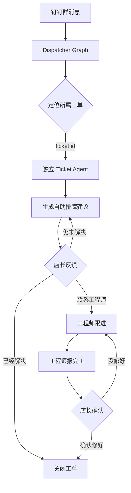

# DingTalk Repair Agent

一个运行在钉钉群里的门店报修工单 Agent。

店长可以直接用自然语言描述故障，系统负责识别意图、创建工单、在多张工单之间准确路由消息，并持续跟进排障、工程师处理、SLA、订单到货和完工确认。项目使用 LangGraph 规范运行流程，每张工单拥有独立的 Agent 状态和 checkpoint。

项目面向多门店共用工程团队的场景：一个钉钉群可以同时存在多张工单，同一群内消息按顺序处理，不同群可以并行运行。

## LangGraph 流程图



Dispatcher 负责把消息分配到正确工单。每张工单使用自己的 `ticket:{ticket_id}` checkpoint，因此同一个群里的多张工单可以分别保存排障进度和处理阶段。

## 主要能力

- **自然语言报修**：从群消息提取主题、位置、故障描述、时效等字段并创建工单。
- **单群多工单**：通过完整编号、短编号、消息引用、用户上下文和语义匹配确定消息归属。
- **每单独立 Agent**：所有工单复用同一份 Ticket Agent Graph，通过 `ticket:{ticket_id}` 隔离上下文。
- **自助排障循环**：新建工单后由 LLM 生成检查建议，并结合关键词和 LLM 判断店长反馈。
- **工程师跟进**：店长提出“联系工程师”后，Agent 转入工程师跟进阶段，继续记录诊断、维修方案、订单、超时原因和完工信息。
- **完工确认**：工程师报完工后进入待店长确认状态；店长可以确认修好，也可以反馈未修好并退回处理。
- **SLA 调度**：支持响应提醒、升级通知、临近到期、工单超时和确认超时。
- **订单协作**：记录采购订单，读取共享表中的物流状态，到货后持续提醒维修。
- **图片附件**：归档群内图片，并可使用独立视觉模型提取故障信息。
- **AI 表格看板**：把 SQLite 中的工单同步到钉钉 AI 表格，用于看板和统计。
- **三种运行模式**：支持 `SHADOW`、`ASSISTED`、`PRODUCTION`。

## LangGraph 编排

LangGraph 只负责运行流程和 Agent 阶段，现有业务规则仍由语义协议、路由器、校验器和工单执行器决定。

系统分为两层 Graph：

1. **Dispatcher Graph** 每收到一条 Inbox 消息运行一次，依次完成消息准备、附件归档、上下文加载、业务处理、工单定位和 Ticket Agent 调用。
2. **Ticket Agent Graph** 按工单运行，保存这张工单的排障摘要、当前阶段、最近反馈和生成的建议。

每张工单使用固定 thread ID：

```text
ticket:{ticket_id}
```

例如同一个群内的工单 12 和工单 19 分别使用 `ticket:12` 和 `ticket:19`。两张工单共用同一个已编译的 Graph，但 checkpoint、对话摘要和处理阶段互不影响。

Agent 阶段包括：

| 阶段 | 含义 |
|---|---|
| `TRIAGE` | 进入工单并判断当前事件 |
| `SELF_SERVICE` | 正在生成或执行自助排障建议 |
| `WAITING_MANAGER` | 等待店长反馈检查结果 |
| `ENGINEER_TRACKING` | 已转工程师，持续跟进处理进度 |
| `WAITING_PARTS` | 等待配件、订单或其他外部条件 |
| `WAITING_CONFIRM` | 工程师已报完工，等待店长确认 |
| `CLOSED` | 工单已完成、取消或停止 |

Agent 每次被消息唤醒时都会重新读取业务数据库，以真实工单状态校正 checkpoint。完整消息、工单状态、SLA 和订单仍保存在业务数据库中。

## 一条报修如何处理

1. `event_listener` 通过 `dws` CLI 监听钉钉群消息。
2. `event_normalizer` 把原始事件转换成统一的 `NormalizedMessage`。
3. 消息写入 Inbox，`InboxWorker` 保证同群串行、跨群并行。
4. Dispatcher Graph 恢复附件和上下文，然后调用现有业务管道。
5. 关键词和 LLM 生成结构化语义决策。
6. Router 根据编号、引用、用户上下文和候选评分定位工单。
7. Validator 检查角色权限、必填字段和工单状态。
8. `TicketCommandExecutor` 在 SQLite 事务中执行建单或状态变更。
9. 消息被交给对应的 Ticket Agent Graph，更新该工单的 Agent 阶段和排障上下文。
10. 通知通过 Outbox 去重后发送到钉钉群。
11. `SchedulerWorker` 独立扫描业务数据库，处理 SLA、订单和看板同步。

模型只负责理解消息和生成建议，不能直接修改数据库，也不能绕过本地协议校验。

## 店长与 Agent 的交互

新故障创建工单后，Agent 会结合工单信息生成一轮排障建议。店长后续反馈由关键词优先识别，表达不明确时再交给 LLM 分类：

| 店长表达示例 | Agent 行为 |
|---|---|
| “清理以后还是不行” | 记录新现象，重新生成排障建议 |
| “已经恢复正常了” | 同步工单完成结果或当前生命周期 |
| “联系工程师处理吧” | 转入 `ENGINEER_TRACKING` |
| 普通闲聊或无法判断 | 不修改工单业务状态 |

在单群多工单场景下，用户可以通过工单编号、回复某条已归档消息或先选择工单来明确上下文，避免把反馈写到其他工单。

## RAG 状态

项目已经定义统一的 `KnowledgeRetriever` 接口，并在 Ticket Agent Graph 中保留以下节点：

```text
build_retrieval_query
  -> retrieve_knowledge
  -> generate_guidance
```

当前使用 `NullKnowledgeRetriever`，固定返回空文档。未配置知识库时，LLM 只依据工单信息和店长最新反馈生成通用建议，不会声称引用了知识库内容。

后续接入向量库、企业知识库或维修手册时，只需要实现新的 Retriever，无需修改 Graph 的主体流程。

## 数据与 checkpoint

系统使用两个独立的 SQLite 文件：

| 文件 | 用途 |
|---|---|
| `data/tickets.db` | 工单、消息、状态、SLA、订单、PendingAction 和 Outbox，是业务真相源 |
| `data/langgraph-checkpoints.sqlite` | Ticket Agent 的阶段和精简上下文 |

LangGraph checkpoint 不参与报表统计，也不替代工单数据库。即使 checkpoint 中的阶段与业务状态不一致，下一次运行也会以 `tickets.db` 为准重新校正。

## 工单生命周期

```text
ACTIVE
  -> ACTIVE_OVERDUE
  -> PENDING_CONFIRM
  -> COMPLETED

ACTIVE / ACTIVE_OVERDUE
  -> PENDING_NEGOTIATION
  -> ACTIVE

ACTIVE / PENDING_CONFIRM / PENDING_NEGOTIATION
  -> CANCELLED 或 STOPPED
```

- 工程师报完工后进入 `PENDING_CONFIRM`。
- 店长确认修好后进入 `COMPLETED`。
- 店长反馈未修好后返回处理中。
- `PENDING_NEGOTIATION` 用于时效暂时无法确定的工单。
- 已取消或停止的工单可以按现有协议重开。

## 技术栈

- Python 3.13+
- asyncio
- LangGraph 1.2
- SQLite / WAL
- httpx
- OpenAI-compatible Chat Completions API
- `dws` CLI
- openpyxl

## 快速开始

### 1. 创建环境

```bash
python3 -m venv .venv
source .venv/bin/activate
pip install -r requirements.txt
```

### 2. 准备群配置

```bash
cp data/groups.example.json data/groups.json
```

在 `data/groups.json` 中配置群 ID、门店名称、店长、工程师、工程负责人、区域经理，以及 `openDingtalkId -> userId` 映射。

### 3. 准备环境变量

```bash
cp .env.example .env
```

至少需要配置模型接口：

```dotenv
LLM_ENABLED=true
LLM_API_KEY=your-api-key
LLM_BASE_URL=https://your-provider.example/v1
LLM_MODEL=your-model

LANGGRAPH_ENABLED=true
LANGGRAPH_CHECKPOINT_PATH=data/langgraph-checkpoints.sqlite
RAG_ENABLED=false
```

文本模型使用 OpenAI-compatible Chat Completions 协议。视觉模型可以通过 `VISION_*` 单独配置。

### 4. 启动

直接启动主系统：

```bash
python main.py --mode PRODUCTION
```

也可以使用管理脚本同时管理主系统和管理后台：

```bash
bash manage.sh start
bash manage.sh status
bash manage.sh logs
bash manage.sh stop
```

运行模式：

| 模式 | 行为 |
|---|---|
| `PRODUCTION` | 按协议执行工单动作并发送通知 |
| `ASSISTED` | 模型来源的动作先等待人工确认 |
| `SHADOW` | 只记录语义决策，不修改工单或发送消息 |

可以只监听指定门店群：

```bash
python main.py --mode PRODUCTION --group "门店名称"
```

也可以指定其他群配置文件：

```bash
python main.py --mode PRODUCTION --groups-config /path/to/groups.json
```

## 常用配置

| 配置项 | 默认值 | 说明 |
|---|---:|---|
| `LANGGRAPH_ENABLED` | `true` | 是否启用 LangGraph 编排 |
| `LANGGRAPH_CHECKPOINT_PATH` | `data/langgraph-checkpoints.sqlite` | Agent checkpoint 文件 |
| `RAG_ENABLED` | `false` | RAG 预留开关，当前仍使用空检索器 |
| `LLM_ENABLED` | `true` | 是否启用文本模型 |
| `LLM_TIMEOUT_SECONDS` | `60` | 单次文本模型超时秒数 |
| `VISION_ENABLED` | `false` | 是否启用视觉模型 |
| `IMAGE_ARCHIVE_ENABLED` | `true` | 是否归档图片附件 |
| `RESPONSE_SLA_ENABLED` | `true` | 是否启用响应 SLA 提醒 |
| `AITABLE_SYNC_ENABLED` | `true` | 是否同步钉钉 AI 表格 |

完整配置见 [`config.py`](./config.py) 和 [`.env.example`](./.env.example)。

## 项目结构

```text
.
├── main.py                    应用入口与组件组装
├── pipeline.py                业务管道兼容入口
├── db.py                      SQLite schema、迁移和数据访问
├── notifier.py                Outbox 与钉钉通知
├── graphs/
│   ├── runtime.py             Graph 和 checkpoint 生命周期
│   ├── dispatcher_graph.py    每条消息的 Dispatcher Graph
│   ├── ticket_agent_graph.py  每张工单的 Ticket Agent Graph
│   ├── troubleshooting.py     关键词 + LLM 反馈识别与建议生成
│   └── retrieval/             RAG 接口和空检索器
├── semantics/                 语义协议、关键词、LLM 分类和校验
├── routing/                   多工单路由、选单上下文和 PendingAction
├── tickets/                   工单命令、仓储和事务执行器
├── workers/                   Inbox、Scheduler 和 AI 表格同步
├── images/                    图片归档与视觉分析
├── reconciling/               订单共享表协作
├── admin/                     管理后台
├── protocols/                 工单语义协议 JSON 与 Schema
├── scripts/                   导出、同步、回放和运维脚本
├── docs/                      业务规则、架构与流程文档
└── data/                      本地数据库和群配置，不提交仓库
```

## 语法检查

项目当前只执行 Python 语法检查：

```bash
python -m compileall -q .
```

## 相关文档

- [LangGraph 运行流程设计](./docs/superpowers/specs/2026-09-15-langgraph-runtime-design.md)
- [LangGraph 运行流程说明](./docs/langgraph-runtime-flow.md)
- [业务流程与工单生命周期](./docs/业务流程与工单生命周期.md)
- [SLA 架构与绩效扩展](./docs/SLA架构设计与绩效考核扩展.md)
- [Docker 部署说明](./README-Docker.md)
- [业务使用须知](./使用须知.txt)

## 当前边界

- RAG 只有接口和空实现，尚未接入真实知识库。
- 钉钉消息监听、通知和 AI 表格同步依赖本机已登录的 `dws` CLI。
- 项目采用单进程 asyncio 和 SQLite，适合当前门店群规模，不面向多实例同时写入。
- 原有业务状态、协议和执行器保持不变，LangGraph 主要负责流程规范化和按工单保存 Agent 上下文。
