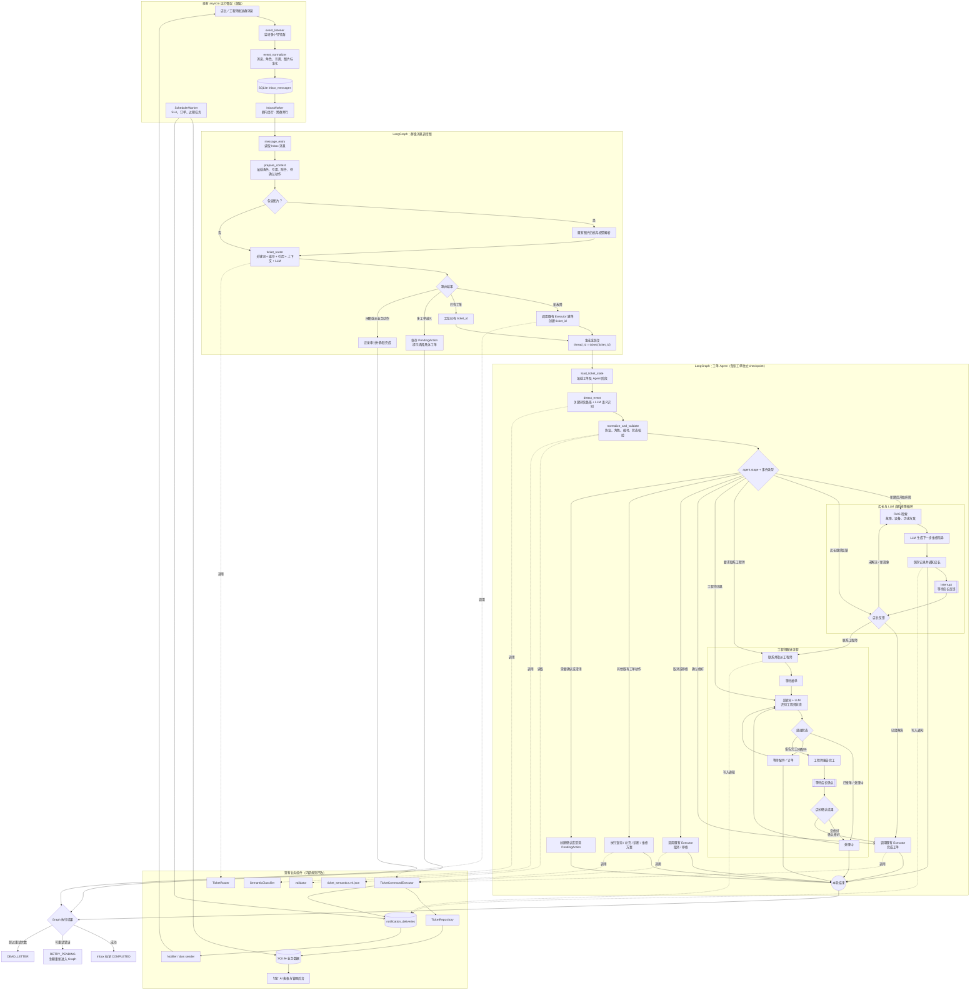

# LangGraph 重写后的系统运行流程

## 设计约束

- 一个群使用一个消息入口和群级路由器。
- 每张工单复用同一份编译后的 LangGraph，以 `ticket:{ticket_id}` 隔离 checkpoint 和对话状态。
- 店长排障主循环为 `RAG → LLM → 指导 → 等待反馈 → 再检索`。
- 转交工程师后，同一个工单 Agent 继续跟踪接单、处理、配件、完工与店长确认。
- SLA 继续由现有 `SchedulerWorker` 扫描 SQLite，不在 LangGraph 节点内长时间等待。
- SQLite 保存业务事实，LangGraph checkpoint 保存流程位置。
- 现有执行器、协议、数据库、Outbox 和通知机制保持复用。
