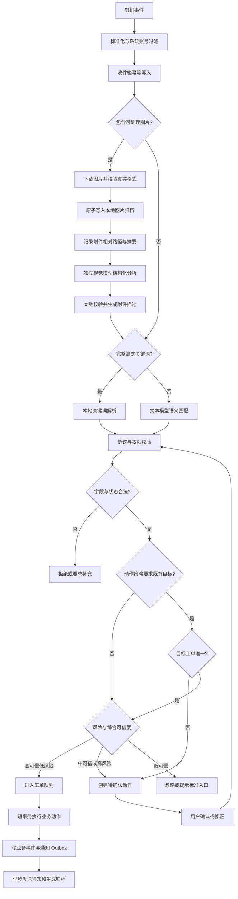

# 钉钉群报修工单归档系统 v4.0 — 设计与实施计划

> **For agentic workers:** 实施本计划时，必须逐任务使用测试驱动开发；建议使用 `subagent-driven-development` 或 `executing-plans`，并在每个阶段结束后独立验收。

**目标：** 建设一个以版本化关键词 JSON 为业务语义协议、通过可配置云端文本模型理解自然语言、通过独立视觉模型分析报修图片，并支持同一钉钉群多张未完成工单并行处理的报修工单系统。

**架构：** 系统采用“确定性规则内核 + 受约束的云端语义匹配器 + 独立视觉分析器”。显式关键词走零文本模型依赖的快路径；自然语言只由文本模型转换成协议内预定义动作和字段；图片由独立 OpenAI-compatible 视觉模型转换成受约束的附件描述。视觉结果只能补充证据和字段候选，不能直接执行业务动作。最终由本地规则引擎完成权限、状态、目标工单、并发和事务校验。不同工单可以并行处理，同一工单严格有序，所有外部通知通过事务型 Outbox 异步发送。

**技术栈：** Python 3.13、`asyncio`、SQLite/WAL、`dws` CLI、OpenAI-compatible 文本与视觉模型接口、Base64 Data URL、JSON Schema、pytest、Markdown/JSON 归档。

> 版本：4.0  
> 日期：2026-08-12  
> 状态：设计已确认，待按阶段实施  
> 核心模式：关键词 JSON 协议优先、文本语义匹配、独立视觉分析、同群多工单并行

---

## 1. 项目概述

### 1.1 项目背景

系统采用“一店一群”模式。每个门店拥有独立的钉钉报修群，群内包含多名店长、工程师、协作人员和一个系统监听账号。

当前已完成多群监听、事件标准化、角色识别、SQLite 基础数据层、消息幂等和乱序保护。但原 v3.0 方案存在两个结构性限制：

1. 业务动作依赖用户严格填写固定关键词模板，自然语言无法可靠建单或推进工单。
2. 数据库强制每个群只能存在一张活动工单，导致同一门店同时发生多个故障时无法独立跟踪，后续消息也无法准确归属。

v4.0 不让大模型直接控制业务，而是先把现有关键词 JSON 重构成完整业务协议，再让云端大模型把用户自然语言匹配到协议中的标准动作。工单创建、更新、关闭、超时和通知仍由本地确定性代码执行。

### 1.2 建设目标

- 关键词 JSON 成为动作、字段、权限、状态和匹配策略的唯一业务真相。
- 保留显式关键词快路径，模型不可用时仍可完成核心操作。
- 自然语言可以识别为新建、补充、诊断、维修方式、超时原因、完成、取消、重开、查询或选择工单。
- 图片可以由独立视觉模型提取设备、位置、可见文字和故障现象，并以受约束的附件描述参与后续语义判断。
- 同一个钉钉群允许同时存在多张未完成工单。
- 后续消息优先通过工单编号、引用关系、用户选择上下文和语义候选匹配归属工单。
- 歧义消息不猜测归属，进入确认或选择流程。
- 不同工单并行处理，同一工单的状态变更按稳定顺序单调应用。
- 云端模型调用不占用数据库长事务，不阻塞钉钉监听。
- 保留 4 小时责任方计时、1／3／7 天 SLA、超时延期、版本历史、Outbox 通知和最终归档。
- 记录协议、提示词、模型、置信度、决策依据和最终执行结果，支持审计与重放。

### 1.3 本轮范围

本轮包含四个可独立验收的子项目：

1. **语义协议：** 重构关键词 JSON、建立 JSON Schema、协议加载器、校验器和带人工标签的测试集。
2. **识别评测：** 接入 OpenAI-compatible 云端模型，完成结构化匹配、离线评测、影子模式和置信度校准。
3. **图片归档与视觉分析：** 接收图片后下载到本地归档目录，以相对路径写入聊天记录 JSON，再通过独立 OpenAI-compatible 视觉模型完成结构化识图、文本语义识别和降级处理。
4. **多工单执行：** 调整数据库约束，增加消息收件箱、工单路由、待确认动作、工单级并发和乐观版本控制。

本轮暂不包含：

- Web 管理后台。
- 自动下载并长期保存图片以外的所有附件原文件；第一阶段只持久化图片，其他文件仅保留元数据。
- 法定节假日日历；4 小时升级仍只处理周六、周日顺延。
- 采购审批、报销或淘宝自动下单。
- 让大模型直接调用数据库、钉钉发送接口或任意代码工具。
- 多模型投票、向量数据库和跨门店知识问答。

---

## 2. 核心设计原则

### 2.1 关键词 JSON 是唯一业务真相

关键词 JSON 不再只是五个字符串模板，而是完整定义：

- 系统允许识别的动作；
- 显式关键词和自然语言语义范围；
- 正例、反例和易混淆表达；
- 允许角色和工单状态；
- 必填、选填字段及归一化规则；
- 是否必须指定目标工单；
- 自动执行、确认和忽略策略；
- 本地执行器名称；
- 模型固定输出结构。

模型只能从协议中选择，不能创造新动作、新字段、新状态或新权限。

### 2.2 大模型负责理解，规则引擎负责执行

云端模型只执行三项任务：

1. 将自然语言匹配到一个协议动作。
2. 按协议字段词典抽取用户明确表达的字段；字段归一化和枚举校验仍由本地完成。
3. 对允许的候选工单分别评分并选择目标，或明确返回需要澄清。

本地规则引擎始终重新校验：

- JSON Schema；
- 角色权限；
- 工单状态；
- 必填字段和枚举；
- 目标工单是否属于当前群；
- 多工单匹配是否唯一；
- 动作是否需要确认；
- 消息幂等和版本冲突。

### 2.3 关键词快路径优先

显式关键词优先于语义模型：

```text
命中完整关键词及字段
  → 本地解析和校验
  → 不调用大模型

未命中完整关键词
  → 云端大模型语义匹配
  → 本地协议校验
```

显式关键词的结果来源记为 `EXPLICIT_KEYWORD`，置信度固定为 1.0。自然语言结果来源记为 `SEMANTIC_MODEL`。

### 2.4 同群多工单、同单严格有序

- 群是数据隔离和候选检索边界，不再是唯一工单容器。
- 同群可同时存在多张 `ACTIVE` 或 `ACTIVE_OVERDUE` 工单。
- 不同工单的消息可以并行识别和执行。
- 同一工单的业务动作按 `(sent_at, message_id)` 稳定顺序单调应用。
- 创建工单和无法确定目标的消息使用短暂群级路由锁。
- 工单写入使用工单级锁和 `version` 乐观并发校验。

### 2.5 不确定时澄清，不猜测

以下情况不得自动执行：

- 两张候选工单相似且分差不足；
- 目标工单编号不存在或不属于当前群；
- 用户表达同时可能是新建和旧单补充；
- 自然语言试图完成、取消或重开工单；
- 必填字段不完整；
- 模型输出不符合协议；
- 当前状态不允许该动作。

### 2.6 最小数据、完整审计

云端模型只接收当前判断需要的最少消息、角色和候选工单摘要。系统必须记录模型和协议版本，但日志不得记录 API Key、鉴权头或无必要的个人信息。

### 2.7 视觉模型只描述，不决策

- 视觉模型与文本语义模型使用相互独立的地址、密钥、模型名、超时和开关。
- Base64 只是图片传输格式，不赋予文本模型识图能力；图片只能发送给明确支持视觉输入的模型。
- 视觉模型只输出图片类型、设备、位置、可见文字、故障现象、置信度和不确定说明。
- 视觉结果必须经过本地 JSON Schema、字段白名单、长度和枚举校验后，才能作为 `attachments[].vision` 进入文本语义判断。
- 图片本身不能直接触发完成、取消、重开、延期等高风险动作；高风险动作仍必须由用户文字、显式关键词或人工确认触发。
- 图片下载和模型调用均发生在数据库长事务之外。图片必须先安全下载并原子写入归档目录，再进行视觉分析；失败时保留已成功落盘的相对路径和附件元数据并提示用户补充文字，不阻塞关键词路径和其他工单。
- 聊天记录、数据库附件记录和最终归档 JSON 只能保存相对于 `ARCHIVE_DIR` 的 POSIX 路径，不保存绝对路径、临时鉴权 URL 或 Base64。

---

## 3. 角色与权限

### 3.1 角色来源

系统根据发送人的钉钉 `userId` 判断角色，不根据昵称猜测。事件中的 `openDingtalkId` 先通过通讯录或缓存映射为 `userId`。

| 角色 | 枚举 | 职责 |
|---|---|---|
| 店长 | `MANAGER` | 报修、补充、确认解决、查询工单 |
| 工程师 | `ENGINEER` | 故障判断、维修方式、超时原因、处理反馈 |
| 其他成员 | `OTHER` | 普通沟通和附件补充，不执行受限动作 |
| 系统账号 | `SYSTEM` | 监听和通知，回流消息不进入业务 |
| 未知成员 | `UNKNOWN` | 默认不执行业务动作 |

同一 `userId` 不得同时属于店长和工程师。程序启动时发现角色重叠必须拒绝加载该群配置。

### 3.2 动作权限

| 动作 | 店长 | 工程师 | 其他成员 | 是否必须匹配工单 |
|---|---:|---:|---:|---:|
| 新建工单 | 允许 | 默认拒绝 | 拒绝 | 否 |
| 补充描述 | 允许 | 允许 | 允许 | 是 |
| 故障判断 | 拒绝 | 允许 | 拒绝 | 是 |
| 维修方式 | 拒绝 | 允许 | 拒绝 | 是 |
| 超时原因 | 拒绝 | 允许 | 拒绝 | 是 |
| 完成工单 | 允许 | 允许 | 拒绝 | 是 |
| 取消工单 | 允许 | 默认拒绝 | 拒绝 | 是 |
| 重开工单 | 允许 | 允许 | 拒绝 | 是 |
| 查询工单 | 允许 | 允许 | 允许 | 可选 |
| 选择工单 | 允许 | 允许 | 允许 | 是 |

最终权限以关键词 JSON 为准，本表是人类可读摘要。

---

## 4. 关键词 JSON 语义协议

### 4.1 文件定位与版本

现有文件：

```text
dashbord/维修工单_流程关键词.json
```

v4.0 将其升级为业务协议，并新增机器校验文件：

```text
dingtalk_script/protocols/ticket_semantics.v4.json
dingtalk_script/protocols/ticket_semantics.schema.json
```

`dashbord/维修工单_流程关键词.json` 保留为业务人员可维护的来源；发布流程将其校验、规范化并生成运行时协议。运行时协议必须带有 `protocol_version` 和内容摘要，历史决策继续引用当时版本。

### 4.2 顶层结构

```json
{
  "protocol_version": "4.0.0",
  "compiled_at": "2026-08-12T10:19:26+08:00",
  "compiled_by": "protocol_compiler",
  "source_sha256": "...",
  "actions": [],
  "field_dictionary": {},
  "routing": {},
  "risk_policies": {}
}
```

业务动作及其角色权限由 `dashbord/维修工单_流程关键词.json` 维护；无显式关键词的 `system.*` 与 `chat.ignore` 控制动作由编译器维护。业务源中的固定协议发布时间参与确定性编译，同一源文件重复编译必须逐字节一致。

### 4.3 标准动作集

| `intent_id` | 显式关键词 | 含义 |
|---|---|---|
| `ticket.create` | `#报修` | 创建新工单 |
| `ticket.add_detail` | `#补充` | 向指定工单补充现象、位置、附件或说明 |
| `ticket.diagnosis.submit` | `#故障判断` | 提交一个或多个故障判断版本 |
| `ticket.repair_plan.submit` | `#维修方式` | 提交维修方式和条件字段 |
| `ticket.timeout_reason.submit` | `#超时原因` | 解释当前超时周期并延期 |
| `ticket.complete` | `#完毕` | 请求完成指定工单 |
| `ticket.cancel` | `#取消工单` | 取消误建、重复或无需维修的工单 |
| `ticket.reopen` | `#重开工单` | 重开已完成或已取消工单 |
| `ticket.query` | `#查询工单` | 查询一张或多张工单 |
| `ticket.select` | `#选择工单` | 建立当前用户的短期工单上下文 |
| `system.clarify` | 无 | 无法安全确定动作或目标，要求确认 |
| `system.confirm_pending_action` | 无 | 确认当前待处理动作 |
| `system.reject_pending_action` | 无 | 拒绝当前待处理动作 |
| `system.correct_pending_action` | 无 | 修正待确认动作中的字段或目标 |
| `chat.ignore` | 无 | 闲聊或无关消息，不执行业务动作 |

### 4.4 单个动作定义

```json
{
  "intent_id": "ticket.create",
  "display_name": "新建维修工单",
  "explicit_keywords": ["#报修"],
  "semantic_enabled": true,
  "allowed_roles": ["MANAGER"],
  "allowed_ticket_states": [],
  "required_fields": [
    "subject",
    "location",
    "problem_description",
    "sla"
  ],
  "optional_fields": ["device", "urgency", "attachments"],
  "target_ticket_policy": "MUST_NOT_EXIST",
  "risk_level": "NORMAL",
  "confirmation_policy": {
    "EXPLICIT_KEYWORD": "NOT_REQUIRED",
    "SEMANTIC_MODEL": "BY_CONFIDENCE"
  },
  "positive_examples": [],
  "negative_examples": [],
  "confirmation_template": "",
  "executor": "create_ticket"
}
```

对 `ticket.create` 而言，`MUST_NOT_EXIST` 表示本次动作不得绑定既有目标工单，不表示当前群不能存在其他活动工单。其余更新类动作使用 `MUST_EXIST`。

每个开启语义匹配的动作至少提供 10 条正例和 10 条反例。完成、取消和重开的反例必须覆盖疑问句、否定句、将来时和不确定表达。

完成、取消和重开的 `confirmation_policy` 必须配置为 `EXPLICIT_KEYWORD: NOT_REQUIRED`、`SEMANTIC_MODEL: ALWAYS`。因此“高风险动作必须确认”只针对自然语言来源；显式关键词仍须通过权限、状态、字段和关闭条件校验，但不增加二次确认。

### 4.5 字段词典

统一使用英文键，中文名称和口语变体只作为别名：

| 字段 | 类型 | 说明 |
|---|---|---|
| `ticket_no` | string | 明确目标工单编号 |
| `subject` | string | 报修对象或场景主题 |
| `location` | string | 故障具体位置 |
| `problem_description` | string | 用户明确描述的故障现象 |
| `device` | string | 用户明确提到的设备名称，可空 |
| `urgency` | enum | `低/中/高`，只按用户明确表达归一化 |
| `attachments` | object[] | 附件类型、消息内标识、归档相对路径、内容摘要及可选的受约束 `vision` 分析结果 |
| `sla` | enum | `1天/3天/7天` |
| `diagnosis_items` | string[] | 一个或多个故障判断 |
| `repair_method` | enum | 五种允许维修方式之一 |
| `order_no` | string | 淘宝采购维修时的订单号 |
| `timeout_reason` | string | 当前超时周期原因 |
| `completion_note` | string | 完成说明，可空 |
| `cancel_reason` | string | 取消原因 |
| `reopen_reason` | string | 重开原因，必须说明复发或继续处理原因 |
| `clarification_reason` | string | 系统要求澄清的原因，只用于展示和审计 |

模型只能抽取用户明确表达的信息。没有位置时返回 `missing_fields: ["location"]`，不得猜测。

图片附件的 `vision` 子结构固定为：

```json
{
  "image_type": "equipment_fault|error_screenshot|document|scene|unknown",
  "device": "商用冷柜",
  "location": "后厨",
  "visible_text": ["E07"],
  "observations": ["显示屏出现红色报警标识"],
  "confidence": 0.86,
  "uncertainty": "无法确认报警代码对应的具体故障"
}
```

除 `image_type` 和 `confidence` 外其余字段均可为空；视觉模型不得输出维修结论、业务动作、目标工单或用户权限。单个文本项和数组元素数量必须受本地限制，超限内容在进入文本语义模型前裁剪或拒绝。

聊天记录 JSON 中的图片附件固定保存为：

```json
{
  "type": "image",
  "relative_path": "attachments/2026/08/12/msg-abc123/00-a1b2c3d4.jpg",
  "file_name": "现场照片.jpg",
  "mime_type": "image/jpeg",
  "byte_size": 245812,
  "sha256": "a1b2c3d4...",
  "vision": {
    "status": "SUCCEEDED",
    "image_type": "equipment_fault",
    "device": "商用冷柜",
    "visible_text": ["E07"],
    "observations": ["显示屏出现红色报警标识"],
    "confidence": 0.86
  }
}
```

`relative_path` 统一相对于 `ARCHIVE_DIR`，使用 `/` 分隔符。读取时必须通过安全连接函数解析，并验证最终绝对路径仍位于 `ARCHIVE_DIR` 内，禁止 `..`、绝对路径和符号链接逃逸。

### 4.6 通用关键词语法

- 去除消息首尾空白后，关键词必须位于消息开头。
- 关键词后只能是消息结束，或空格、制表符、换行后继续填写工单编号和字段。
- 全角冒号 `：` 与半角冒号 `:` 在字段分隔位置统一归一化；字段值本身保持原文。
- 开头的 `@成员` 可以在匹配前移除，但消息正文中的 `@` 不删除。
- 同一必填字段重复出现且值不一致时拒绝执行，要求完整重发。
- 同一条消息出现两个不同业务关键词时返回 `system.clarify`，要求拆成两条消息。
- 一条自然语言消息只能产生一个业务动作并最终归属一张工单；涉及多动作或多工单时必须拆分或确认。
- 附件只作为当前消息元数据，不从文件名猜测正式业务字段。
- 视觉结果只作为附件证据；不得仅凭图片自动完成、取消、重开、延期或变更 SLA。

### 4.7 现有正式字段规则

#### `ticket.create`

`#报修` 必填：主题、位置、问题描述、时效。时效只能为 `1天`、`3天`、`7天`。

#### `ticket.diagnosis.submit`

仅工程师提交，至少一项故障判断；最新完整版本为当前值，旧版本保留。

#### `ticket.repair_plan.submit`

维修方式只能单选：

- 淘宝采购后自行维修；
- 需要供应商维修；
- 需要木工维修；
- 需要工程师上门；
- 远程视频维修。

选择淘宝采购时订单号必填。订单号移除空白后只能包含英文字母、数字和连字符，长度 6～64，不能使用“无、暂无、稍后补、不知道”等占位值。

#### `ticket.timeout_reason.submit`

仅工程师提交，且目标工单必须存在尚未解释的超时周期。同一超时周期只接受一次有效原因。

#### `ticket.complete`

关闭前必须存在故障判断、维修方式、采购场景下的有效订单号，并且全部超时周期已经解释。

### 4.8 完整动作约束矩阵

| 动作 | 目标策略 | 允许状态 | 必填字段 | 风险 |
|---|---|---|---|---|
| `ticket.create` | 不绑定既有工单 | 无 | `subject/location/problem_description/sla` | 普通 |
| `ticket.add_detail` | 必须唯一目标 | `ACTIVE/ACTIVE_OVERDUE` | 至少一个可补充字段或附件 | 低 |
| `ticket.diagnosis.submit` | 必须唯一目标 | `ACTIVE/ACTIVE_OVERDUE` | `diagnosis_items` | 普通 |
| `ticket.repair_plan.submit` | 必须唯一目标 | `ACTIVE/ACTIVE_OVERDUE` | `repair_method`，采购时含 `order_no` | 普通 |
| `ticket.timeout_reason.submit` | 必须唯一目标 | `ACTIVE_OVERDUE` | `timeout_reason` | 普通 |
| `ticket.complete` | 必须唯一目标 | `ACTIVE/ACTIVE_OVERDUE` | 无新增必填字段，执行关闭校验 | 高 |
| `ticket.cancel` | 必须唯一目标 | `ACTIVE/ACTIVE_OVERDUE` | `cancel_reason` | 高 |
| `ticket.reopen` | 必须唯一目标 | `COMPLETED/CANCELLED` | `reopen_reason` | 高 |
| `ticket.query` | 目标可选 | 任意 | 无 | 低 |
| `ticket.select` | 必须唯一目标 | `ACTIVE/ACTIVE_OVERDUE` | `ticket_no` | 低 |
| `system.clarify` | 候选可选 | 任意 | `clarification_reason` | 无副作用 |
| `system.confirm_pending_action` | 绑定待确认动作 | `WAITING` | 无 | 高，原子执行已确认动作 |
| `system.reject_pending_action` | 绑定待确认动作 | `WAITING` | 无 | 无业务副作用 |
| `system.correct_pending_action` | 绑定待确认动作 | `WAITING` | 至少一个修正字段 | 无直接副作用 |
| `chat.ignore` | 无目标 | 任意 | 无 | 无副作用 |

`ticket.query` 未指定目标时，默认返回当前群最多 20 张未完成工单，按最近业务事件倒序排列；指定编号时返回单张详情。查询不改变选择上下文，也不写 `message_ticket_links`，只记录查询审计。

待确认修正只允许修改原动作 `required_fields/optional_fields` 白名单中的字段；不能通过修正改变 `intent`。目标工单只能从原候选列表中重新选择，选择列表外工单时必须重新路由。

### 4.9 模型固定输出

```json
{
  "protocol_version": "4.0.0",
  "source": "SEMANTIC_MODEL",
  "intent": "ticket.add_detail",
  "target_ticket_no": "测试群（示例）-收银机-1天-003",
  "intent_confidence": 0.93,
  "fields": {
    "problem_description": "门现在完全无法关闭"
  },
  "missing_fields": [],
  "candidate_scores": [
    {"ticket_no": "测试群（示例）-收银机-1天-003", "score": 0.95},
    {"ticket_no": "测试群（示例）-打印机-3天-006", "score": 0.42}
  ],
  "evidence": ["消息描述门无法关闭，与候选工单位置和主题一致"],
  "requires_confirmation": false
}
```

任何协议外动作、字段、枚举和工单编号均由本地校验器拒绝。

`source` 只允许 `EXPLICIT_KEYWORD` 或 `SEMANTIC_MODEL`。关键词匹配器和模型分类器分别在本地写入固定来源，不能接受用户或模型自行覆盖；验证器据此应用不同确认策略。

---

## 5. 置信度与确认策略

### 5.1 综合可信度

模型自报 `confidence` 不是唯一依据。决策器还必须考虑：

- 显式关键词是否命中；
- 必填字段是否齐全；
- 角色和工单状态是否合法；
- 目标工单是否唯一；
- 第一、第二候选的分差；
- 是否包含否定、疑问或不确定表达；
- 动作风险等级；
- 模型输出是否符合 Schema。

系统不把上述因素加权成一个不可解释的总分，而是使用固定决策表：

1. Schema、角色、状态、字段类型、目标群任一失败：`VALIDATION_REJECTED`。
2. 意图置信度 `< 0.70`：不执行；疑似业务消息提示标准入口，普通闲聊静默忽略。
3. 意图置信度 `0.70～0.89`：进入确认。
4. 意图置信度 `>= 0.90` 后，再独立检查字段完整性、动作风险和路由分数。
5. 必填字段缺失、高风险动作、目标不唯一或存在否定／疑问防护命中：进入确认或补充流程。
6. 仅当全部硬条件通过时自动执行。

### 5.2 三档决策

| 档位 | 默认范围 | 处理 |
|---|---:|---|
| 高可信 | `>= 0.90` | 低风险动作可自动执行 |
| 中可信 | `0.70～0.89` | 创建待确认动作 |
| 低可信 | `< 0.70` | 普通闲聊静默忽略；疑似业务消息提示标准入口 |

阈值是初始值，必须通过盲测集和影子数据校准后才能进入自动执行模式。

意图置信度与路由分数是两个独立维度。意图置信度高但最佳路由分数为 `0.65～0.89` 时列出候选澄清；最佳路由分数 `< 0.65` 时不展示低相关候选，直接要求用户提供工单编号。不存在 `0.65～0.69` 的意图阈值空档。

### 5.3 动作风险

| 动作 | 高可信自然语言 | 中可信 | 显式关键词 |
|---|---|---|---|
| 新建 | 字段完整时自动执行 | 确认 | 直接执行 |
| 补充 | 目标唯一时自动执行 | 选择工单 | 直接执行 |
| 诊断／维修方式／超时原因 | 权限、字段、目标均合法时执行 | 确认或补字段 | 直接执行 |
| 完成 | 必须确认 | 必须确认 | 指定工单后执行 |
| 取消 | 必须确认 | 必须确认 | 指定工单后执行 |
| 重开 | 必须确认 | 必须确认 | 指定工单后执行 |
| 查询 | 自动执行 | 选择查询对象 | 直接执行 |

### 5.4 待确认动作

待确认动作状态：

```text
WAITING → CONFIRMED / REJECTED / EXPIRED / SUPERSEDED
```

- 默认有效期 30 分钟。
- 同一用户在同一群只能有一个当前 `WAITING` 动作。
- 新澄清请求产生时，旧请求改为 `SUPERSEDED`。
- 用户可以回复序号、工单编号、确认、拒绝或直接修正字段。
- 过期后必须重新读取候选工单和最新协议，不复用旧快照执行。
- `pending_actions` 使用 `version` 和条件更新；只有 `WHERE id=? AND group_id=? AND user_id=? AND status='WAITING' AND version=?` 更新成功，才能确认、拒绝、修正、过期或替换。
- 确认消息必须与待确认动作处于同一群、由同一用户发送，跨群确认无效。
- 高风险动作确认时保存目标工单版本；确认前版本已变化则原动作改为 `SUPERSEDED`，基于最新状态生成新的确认，不允许自动重试执行。

---

## 6. 多工单消息路由

### 6.1 路由优先级

```text
明确工单编号
  > 钉钉回复／引用关系
  > 用户短期选择上下文
  > 活动工单语义候选匹配
  > 创建待确认动作
```

### 6.2 候选工单范围

默认只向模型提供当前群的：

- `ACTIVE`；
- `ACTIVE_OVERDUE`；
- 仅在识别到重开倾向时，提供最近 30 天内关闭的最多 5 张工单。

候选摘要只包含工单编号、主题、位置、问题描述摘要、状态和最近进展，不发送完整历史消息。

### 6.3 语义自动路由条件

初始配置：

```json
{
  "auto_route_threshold": 0.90,
  "clarify_threshold": 0.65,
  "minimum_score_gap": 0.15
}
```

只有第一候选达到自动路由阈值，且与第二候选的分差不小于 `0.15`，才允许自动归属。否则列出候选供用户选择。

新建与补充冲突使用同一候选评分，但门槛设为 `0.85`：自然语言报修与任一活动工单的路由分数达到 `0.85` 时，必须确认“新建还是补充”；显式完整 `#报修` 仍直接新建。

### 6.4 用户短期工单上下文

用户发送：

```text
#选择工单 测试群（示例）-收银机-1天-003
```

系统建立 `(group_id, user_id)` 维度的 30 分钟上下文。之后未写工单编号的补充消息优先关联该工单。以下情况立即清除上下文：

- 用户选择另一张工单；
- 工单被完成或取消；
- 上下文过期；
- 用户明确发送“取消选择”。

选择上下文只帮助需要既有目标的动作，不会把明确的 `ticket.create` 改写成补充动作。

### 6.5 新建与补充冲突

自然语言看起来像新报修，但与现有工单高度相似时，不直接新建。系统必须询问：

```text
1. 新建一张工单
2. 补充到 测试群（示例）-房门-3天-002
3. 补充到 测试群（示例）-门锁-1天-005
```

显式完整 `#报修` 表示用户明确要求新建，不受同群已有活动工单限制。

---

## 7. 完整消息处理流程



关键时序：

1. 监听器只负责标准化和快速写入收件箱。
2. 图片来源解析、下载、落盘、视觉模型和文本模型调用均发生在数据库长事务之外。
3. 下载后先以临时文件写入同一目标文件系统，完成大小、文件签名和 SHA-256 校验后使用原子重命名落盘。
4. 图片归档路径固定为 `archives/attachments/YYYY/MM/DD/{safe_message_id}/{attachment_index}-{digest_prefix}.{ext}`；聊天 JSON 中只写相对于 `archives/` 的路径。
5. 已落盘图片通过 `data:image/...;base64,...` 传给视觉模型；Base64 不发送给文本语义模型，也不写入日志、数据库或聊天 JSON。
6. 视觉结果转换成受约束附件描述，与用户文字一起交给文本模型进行语义识别。
7. 视觉模型失败时仍保留本地图片路径和附件元数据；纯图片消息提示用户补充文字，带文字消息继续按文字处理。
8. 模型返回后重新读取最新工单状态。
9. 执行器在短事务中完成条件更新、业务事件和 Outbox 写入。
10. 外部通知在事务提交后异步发送，并生成引用相同相对路径的聊天 JSON 和工单归档。

候选快照同时保存候选编号、版本和摘要哈希值。模型返回后如果目标工单状态／版本变化、候选集合变化，或出现新的高相似候选，路由器必须废弃旧自动路由结果：普通动作最多重新识别一次，高风险动作直接重新确认。

---

## 8. 并发与顺序保证

### 8.1 收件箱状态机

```text
RECEIVED
  → CLASSIFYING
  → CLASSIFIED
  → ROUTING
  → EXECUTING
  → COMPLETED
```

异常状态：

```text
WAITING_CONFIRMATION
RETRY_PENDING
MODEL_FAILED
VALIDATION_REJECTED
DEAD_LETTER
```

状态转换规则：

```text
RECEIVED --原子抢占并写租约--> CLASSIFYING
CLASSIFYING --成功--> CLASSIFIED
CLASSIFYING --本次单次模型调用失败--> RETRY_PENDING --到期重新抢占--> CLASSIFYING
CLASSIFYING --累计第三次仍失败--> DEAD_LETTER
CLASSIFIED --> ROUTING --> EXECUTING --> COMPLETED
任一持租约状态 --租约过期--> 回到前一可重试状态
```

Inbox Worker 是唯一重试所有者：模型客户端每次只发起一次 HTTP 请求，不在内部重试。`max_attempts=3` 表示 Inbox 记录累计最多三次模型调用，只使用两段退避 `[2, 10]`。每次抢占租约默认 60 秒，模型调用期间每 10 秒续租；转入 `RETRY_PENDING` 时立即释放租约。`attempts` 只统计实际模型 HTTP 调用次数。

### 8.2 两级锁

识别与提交分成两段：

1. 同一群的多条消息可以并发调用云端模型，识别阶段不持有数据库锁。
2. 识别完成后，由群级路由序列器按 `(sent_at, message_id)` 顺序提交“创建工单或确定目标工单”的结果。
3. 目标确定后，消息立即转入对应工单队列；不同工单从此并行，同一工单继续保持顺序。

该序列器解决“用户先报修、紧接着补充照片，但补充消息的模型响应更快”造成的竞态。较慢的前序识别最多导致当前群路由短暂排队，不占用数据库事务，也不阻塞其他群。

路由序列器使用可配置的 2 秒重排窗口吸收正常网络乱序。超过窗口才到达、且顺序键早于工单 `last_business_event_at/last_business_message_id` 的消息标记为 `LATE_ARCHIVE`：原文可以归档到已明确匹配的工单，但不得覆盖结构化字段、切换责任方、完成／取消／重开或回退版本。系统不声称能预知无限迟到的未来事件，而是保证状态变更顺序永不倒退。

**群级路由锁**只保护：

- 创建新工单的序号分配；
- 读取和固定候选工单快照；
- 更新用户选择上下文；
- 创建或替换待确认动作。

群级锁内禁止调用云端模型或钉钉接口。

**工单级执行锁**保护：

- 同工单业务动作的有序应用；
- 责任方切换；
- 版本历史；
- 完成、取消和重开；
- SLA 与超时周期变更。

### 8.3 乐观版本控制

每张工单增加 `version INTEGER NOT NULL DEFAULT 1`。更新使用：

```sql
UPDATE tickets
SET status = ?, version = version + 1
WHERE id = ? AND version = ?;
```

更新行数为 0 表示版本冲突。处理器必须重新加载工单、重新验证动作，最多重试有限次数，不能覆盖其他任务的更新。

普通低风险动作可以在重新验证后有限重试；已经由用户确认的完成、取消和重开遇到版本冲突时不得重试执行，必须重新生成确认。

### 8.4 SQLite 使用约束

第一阶段继续使用 SQLite：

- WAL 模式；
- 云端调用不进入事务；
- 事务保持短小；
- 单独协调数据库写入；
- 工单级异步锁；
- 所有外部通知走 Outbox。

“不同工单并行”指模型识别、候选准备、路由、通知和归档任务可以并行；SQLite 写事务仍由数据库协调器短暂串行提交。验收不要求两个 SQLite 写事务同时运行，而要求一张工单的慢模型或外部调用不阻塞另一张工单。

当需要多进程或多实例水平扩展时再迁移 PostgreSQL，业务层通过仓储接口隔离数据库差异。

---

## 9. 工单生命周期与业务规则

### 9.1 工单状态

| 状态 | 含义 | 是否终态 |
|---|---|---:|
| `ACTIVE` | 正常处理中 | 否 |
| `ACTIVE_OVERDUE` | 已到期，等待原因或完成条件 | 否 |
| `COMPLETED` | 完成校验通过 | 是 |
| `CANCELLED` | 误建、重复或无需维修 | 是 |

`ticket.reopen` 可以将 `COMPLETED/CANCELLED` 恢复为 `ACTIVE`，同时建立新的责任周期并增加工单版本。

### 9.2 工单编号

格式保持：

```text
店名-主题-时效-NNN
```

序号每群独立递增，关闭后不回收。同群并行建单通过群级短事务原子分配序号。

### 9.3 责任方切换

每张工单独立维护等待责任方：

| 最新有效人工消息发送方 | 下一等待方 |
|---|---|
| 店长 | 工程师方 |
| 工程师 | 店长方 |
| 其他成员 | 不切换 |

只有已经明确关联到工单的消息才能切换该工单责任方。待确认或未归属消息不能改变任何工单的计时。

### 9.4 4 小时未回复升级

- 工程师方未回复：群内提醒全部工程师，私发工程负责人。
- 店长方未回复：群内提醒全部店长，私发区域经理。
- 同一责任周期只提醒一次。
- 周末到期顺延到下周一 09:00；期间收到责任方回复则取消。
- 每张并行工单独立计时，不能因同群另一张工单有回复而取消当前工单提醒。

### 9.5 总时效与延期

- 初始 SLA 为建单时间加 1／3／7 天。
- 到期未完成时提醒双方和双方上级，建立 `WAITING_REASON` 超时周期。
- 工程师提交有效超时原因后，从提交时间按初始 SLA 延长一轮。
- 每个超时周期独立保存旧截止时间、原因、新截止时间和提交人。

### 9.6 完成校验

完成前检查：

1. 当前故障判断至少一项；
2. 当前维修方式存在且合法；
3. 淘宝采购方式存在有效订单号；
4. 所有已发生的超时周期都有原因；
5. 目标工单版本仍与确认时一致，或重新确认最新状态。

自然语言完成请求必须确认；显式 `#完毕 <工单编号>` 可在校验通过后直接完成。

店长和工程师均沿用现有业务权限，可以请求完成；自然语言确认是对发起人意图的二次确认，不要求另一角色复核。若未来需要店长最终验收，应作为新的协议版本和状态流转设计，不能隐式加入本版本。

### 9.7 取消与重开

- 取消不等同于完成，必须保存取消原因、操作者和时间。
- 重复工单取消时可记录 `duplicate_of_ticket_id`。
- 重开不覆盖历史完成或取消事件，只追加新的生命周期事件。

---

## 10. 云端模型接入

### 10.1 供应商无关接口

通过 OpenAI-compatible 配置切换服务：

```text
LLM_BASE_URL
LLM_API_KEY
LLM_MODEL
LLM_TIMEOUT_SECONDS=15
LLM_MAX_ATTEMPTS=3
```

不得在代码、JSON 协议或日志中写入 API Key。

### 10.2 模型输入

每次只发送：

- 当前消息；
- 当前用户角色；
- 当前群的必要标识；
- 与角色和状态相关的协议子集；
- 少量候选工单摘要；
- 当前待确认动作或选择上下文；
- 固定输出 Schema。

### 10.3 重试和失败

默认：

```json
{
  "timeout_seconds": 15,
  "max_attempts": 3,
  "retry_delays_seconds": [2, 10]
}
```

模型超时、限流、非 JSON、Schema 错误、协议外动作和内容安全拦截均不得修改工单。超过重试次数进入死信，关键词快路径仍可用。

进入死信后，系统以 `model-failed:{message_id}` 去重发送一次提示：“智能识别暂时不可用，本条消息尚未执行，请使用标准关键词或稍后重试”。同时产生运维告警。死信只允许人工重放；重放使用当前协议和当前工单状态重新识别，超过 30 分钟或涉及高风险动作时一律进入确认，不能直接执行旧预测。

### 10.4 提示注入防护

- 用户消息作为不可信数据字段传入；
- 模型不配置任何数据库或发送工具；
- 只接受固定 JSON 输出；
- 本地重新校验动作、角色、状态和目标群；
- “忽略规则、关闭全部工单”等文本不能产生协议外批量动作。

### 10.5 版本审计

每次语义决策记录：

- `protocol_version`；
- `protocol_digest`；
- `prompt_version`；
- `model_provider`；
- `model_name`；
- 模型请求追踪号；
- 原始结构化输出；
- 本地校验结果；
- 最终动作和目标工单。

### 10.6 独立视觉模型接入

视觉模型使用独立的 OpenAI-compatible 配置，不复用文本模型密钥：

```bash
VISION_ENABLED=true
VISION_BASE_URL=https://example.com/v1
VISION_API_KEY=通过环境变量注入
VISION_MODEL=支持图像输入的模型名
VISION_TIMEOUT_SECONDS=30
VISION_MAX_ATTEMPTS=2
VISION_MAX_IMAGE_BYTES=10485760
VISION_MAX_IMAGES_PER_MESSAGE=3
VISION_ALLOWED_MIME_TYPES=image/jpeg,image/png,image/webp
IMAGE_ARCHIVE_SUBDIR=attachments
```

调用 `/chat/completions` 时使用多模态 `content` 数组：

```json
{
  "model": "${VISION_MODEL}",
  "messages": [
    {
      "role": "user",
      "content": [
        {
          "type": "text",
          "text": "仅按给定 Schema 描述图片，不判断业务动作。"
        },
        {
          "type": "image_url",
          "image_url": {
            "url": "data:image/jpeg;base64,..."
          }
        }
      ]
    }
  ],
  "response_format": {
    "type": "json_object"
  }
}
```

图片来源通过 `ImageSourceResolver` 抽象统一解析，并由 `ImageArchiveStore` 持久化：

1. 钉钉临时下载地址或媒体标识；
2. 受信任的 HTTPS 临时 URL；
3. 本地测试文件；
4. 已有 Data URL 或原始 Base64 测试输入。

生产环境必须拒绝任意外部指定的本地路径、非 HTTPS 外部 URL、重定向到内网地址、未知 MIME、压缩炸弹和超出限制的图片。下载器必须设置连接／读取超时、最大响应体和重定向次数。持久化文件名只能由日期、清洗后的消息 ID、附件序号、内容摘要和真实扩展名生成，不得直接使用用户文件名拼接路径。

图片必须保存到：

```text
archives/attachments/YYYY/MM/DD/{safe_message_id}/{attachment_index}-{digest_prefix}.{ext}
```

保存顺序固定为“流式下载到同目录临时文件 → 检测真实 MIME 和大小 → 计算 SHA-256 → `fsync` → 原子重命名 → 写 `message_attachments` 数据库记录”。同一 `message_id + attachment_index + sha256` 重复到达时复用已存在文件，不重复下载和调用视觉模型。聊天 JSON 只保存 `attachments/...` 相对路径；数据库同时保存相对路径、摘要、大小和 MIME，用于完整性检查。

视觉分析结果单独记录 `vision_provider`、`vision_model`、`prompt_version`、请求追踪号、输入摘要、结构化输出、校验结果、耗时和错误类型。原始图片按本计划持久化到本地归档目录；不得持久化 Base64、鉴权头或临时鉴权 URL。图片删除必须走显式的数据留存／清理流程，并同步处理数据库记录和聊天 JSON，不允许后台临时清理器擅自删除已引用文件。

---

## 11. 数据模型调整

### 11.1 删除单群单活动工单约束

移除：

```sql
CREATE UNIQUE INDEX idx_tickets_one_active
ON tickets(group_id)
WHERE status IN ('ACTIVE', 'ACTIVE_OVERDUE');
```

新增普通索引：

```sql
CREATE INDEX idx_tickets_group_status
ON tickets(group_id, status);
```

`groups.current_ticket_id` 不再参与业务，可迁移后废弃。活动工单统一按 `group_id + status` 查询。

### 11.2 tickets 新增字段

| 字段 | 说明 |
|---|---|
| `version` | 乐观并发版本 |
| `cancelled_at` | 取消时间 |
| `cancelled_by` | 取消人 |
| `cancel_reason` | 取消原因 |
| `duplicate_of_ticket_id` | 重复工单关联，可空 |
| `reopen_count` | 重开次数 |

### 11.3 inbox_messages

保存所有进入业务管道的人工消息，即使尚未归属工单：

| 字段 | 说明 |
|---|---|
| `message_id` | 主键、钉钉幂等键 |
| `group_id` | 所属群 |
| `sender_id/role` | 发送人和角色快照 |
| `content/message_type` | 标准化内容 |
| `reply_to_message_id` | 钉钉引用的原消息 ID，可空 |
| `sent_at/received_at` | 业务时间和接收时间 |
| `status` | 收件箱状态 |
| `processed_result` | `EXECUTED/CONFIRMATION_CREATED/IGNORED/LATE_ARCHIVE/REJECTED`，可空 |
| `attempts/next_attempt_at/last_error` | 重试信息 |
| `claimed_by/claimed_at/lease_until` | 工作器租约和崩溃恢复 |
| `candidate_snapshot_digest` | 模型调用时的候选快照摘要 |

### 11.4 semantic_decisions

保存一次或多次识别结果，不直接表示已经执行：

- 消息 ID；
- 协议、提示词、模型版本；
- 意图、字段、候选工单；
- 意图置信度、每张候选工单的路由分数和本地决策；
- 是否需要确认；
- 验证错误。

### 11.4A vision_decisions

每张进入视觉模型的图片保存一条可审计记录，不保存 Base64：

| 字段 | 说明 |
|---|---|
| `id/message_id/attachment_index` | 主键、来源消息和附件序号 |
| `source_type/source_digest` | 图片来源类型和内容摘要，不保存临时鉴权 URL |
| `mime_type/byte_size` | 经本地检测后的真实格式和大小 |
| `provider/model/prompt_version` | 视觉服务和提示词版本 |
| `status` | `SUCCEEDED/FAILED/SKIPPED/REJECTED` |
| `structured_output` | 通过本地校验的视觉 JSON，可空 |
| `confidence/latency_ms` | 置信度和耗时 |
| `request_trace_id/error_code` | 服务追踪号和归一化错误码 |
| `created_at` | 创建时间 |

同一 `message_id + attachment_index + source_digest + model + prompt_version` 建立唯一约束，防止重试时重复计费。源图片发生变化或模型／提示词升级时允许生成新版本记录。

### 11.4B message_attachments

图片下载成功后立即写入附件记录，使尚未归属工单的 Inbox 消息也能稳定引用本地文件：

| 字段 | 说明 |
|---|---|
| `id` | 主键 |
| `message_id/attachment_index` | 来源消息与附件序号，联合唯一 |
| `attachment_type` | 第一阶段固定为 `image` |
| `original_file_name` | 用户侧文件名，仅展示，不参与路径生成 |
| `relative_path` | 相对于 `ARCHIVE_DIR` 的 POSIX 路径 |
| `mime_type/byte_size/sha256` | 真实格式、大小和内容摘要 |
| `download_status` | `PENDING/DOWNLOADING/STORED/FAILED/REJECTED` |
| `vision_status/vision_decision_id` | 视觉处理状态和关联记录，可空 |
| `created_at/stored_at` | 创建与落盘时间 |
| `last_error` | 脱敏错误，可空 |

`relative_path` 必须唯一；`message_id + attachment_index` 必须唯一。数据库记录为索引和审计真相，文件系统为图片内容真相。启动巡检应检测“记录存在但文件缺失”“文件存在但无记录”“摘要不一致”三类异常，禁止静默忽略。

### 11.5 message_ticket_links

记录消息最终归属：

| 字段 | 说明 |
|---|---|
| `message_id` | 唯一消息 |
| `ticket_id` | 目标工单 |
| `link_type` | `EXPLICIT/QUOTE/CONTEXT/SEMANTIC/CONFIRMED/LATE_ARCHIVE` |
| `routing_score` | 路由分数 |
| `linked_at` | 归属时间 |

一条消息只能有一个当前有效业务归属。历史纠正通过审计事件保留，不能静默覆盖。

### 11.6 ticket_contexts

以 `(group_id, user_id)` 为唯一当前上下文，保存选中的工单、消息顺序键和过期时间。更新使用群用户锁 `context:{group_id}:{user_id}`，而不是目标工单锁；完成或取消工单时通过 `clear_by_ticket(ticket_id)` 清除所有指向该工单的上下文。

### 11.7 pending_actions

保存待确认动作、候选工单、抽取字段、来源消息、状态、`version` 和过期时间。同一 `(group_id, user_id)` 只允许一条 `WAITING` 记录，所有状态变化使用带版本和当前状态条件的原子更新。

### 11.8 action_executions

以唯一执行记录消除崩溃窗口：

| 字段 | 说明 |
|---|---|
| `id` | 主键 |
| `dedupe_key` | 唯一键；直接动作使用消息 ID，确认动作使用待确认动作 ID 与版本 |
| `source_message_id` | 原业务消息 ID |
| `confirmation_message_id` | 确认消息 ID，可空 |
| `pending_action_id` | 待确认动作，可空 |
| `intent/target_ticket_id` | 最终动作和目标 |
| `command_json` | 校验后的命令快照 |
| `status` | `PENDING/APPLIED/REJECTED` |
| `created_at/applied_at` | 创建和应用时间 |

直接动作或确认动作都必须在一个 SQLite 事务中完成：

1. 插入唯一 `action_executions`；
2. 确认场景原子 CAS `pending_actions`；
3. 写消息归属和业务变更；
4. 写业务事件和通知 Outbox；
5. 将执行记录改为 `APPLIED`；
6. 直接动作将来源 Inbox 改为 `COMPLETED`；确认动作同时将原 `WAITING_CONFIRMATION` 消息和确认消息改为 `COMPLETED`。

事务前崩溃不会留下任何结果；事务后崩溃时 Inbox 已同时完成。重放遇到同一 `dedupe_key` 的 `APPLIED` 记录只返回既有结果，不重复执行。`message_ticket_links` 不得在该事务之前单独写入。

### 11.9 现有表继续保留

以下表继续按每张工单独立工作：

- `responsibility_cycles`；
- `messages`；
- `processed_events`；
- `diagnosis_versions`；
- `repair_method_versions`；
- `timeout_cycles`；
- `notification_deliveries`。

现有 `tickets.last_business_event_at` 与 `tickets.last_business_message_id` 继续作为状态变更顺序游标，并与业务变更在同一事务中单调更新。迟到消息的 Inbox 状态仍以 `COMPLETED` 结束，同时将 `processed_result` 和 `message_ticket_links.link_type` 记为 `LATE_ARCHIVE`。

通知 Outbox 的 `dedupe_key` 必须包含 `ticket_id` 和周期 ID，避免并行工单互相去重。

---

## 12. 通知、归档与可观测性

### 12.1 事务型 Outbox

业务事务只写 `PENDING` 通知任务。事务提交后，发送器调用钉钉接口并标记 `SENT/FAILED/CANCELLED`。群消息、上级私信和确认提示使用独立去重键。

### 12.2 Markdown 与聊天 JSON 归档

路径保持：

```text
archives/YYYY-MM/店名-主题-时效-NNN.md
```

每张工单同时生成机器可读聊天记录：

```text
archives/YYYY-MM/店名-主题-时效-NNN.json
```

聊天 JSON 顶层至少包含 `ticket`、`messages`、`generated_at` 和 `schema_version`。图片消息示例：

```json
{
  "message_id": "msg-abc123",
  "sent_at": "2026-08-12T14:30:00+08:00",
  "sender_id": "user-1",
  "sender_name": "店长",
  "sender_role": "MANAGER",
  "message_type": "image",
  "content": "冷柜出现这个报警",
  "attachments": [
    {
      "type": "image",
      "relative_path": "attachments/2026/08/12/msg-abc123/00-a1b2c3d4.jpg",
      "file_name": "现场照片.jpg",
      "mime_type": "image/jpeg",
      "byte_size": 245812,
      "sha256": "a1b2c3d4...",
      "vision": {
        "status": "SUCCEEDED",
        "image_type": "equipment_fault",
        "device": "商用冷柜",
        "location": null,
        "visible_text": ["E07"],
        "observations": ["显示屏出现红色报警标识"],
        "confidence": 0.86,
        "uncertainty": "无法确认报警代码对应的具体故障"
      }
    }
  ],
  "semantic_decision_id": 123,
  "ticket_link_type": "SEMANTIC"
}
```

JSON 中不得写绝对路径。相对路径解析基准固定为 `ARCHIVE_DIR`，不是 JSON 文件所在目录；迁移或备份时必须整体复制 `archives/`。归档器使用临时文件加原子替换写 JSON，避免进程崩溃产生半截文件。

归档增加：

- 工单生命周期事件；
- 语义识别来源和协议版本；
- 消息归属方式；
- 用户确认和修正记录；
- 取消、重复和重开历史；
- 完整人工消息时间线。
- 每条消息的附件相对路径、内容摘要、视觉分析状态和结构化结果。

### 12.3 运行指标

至少统计：

- 每日消息量和收件箱积压；
- 关键词与模型路径占比；
- 模型耗时、失败率、重试和费用；
- 各意图数量；
- 自动执行、确认、忽略数量；
- 用户纠正率；
- 工单自动路由率和澄清率；
- 死信数量；
- 重复动作、乱序和版本冲突数量。

---

## 13. 测试策略与验收指标

### 13.1 协议测试

- JSON Schema 合法；
- `intent_id` 和显式关键词不冲突；
- 字段、枚举、角色和状态引用有效；
- 所有可执行动作存在本地执行器；
- 语义动作包含足量正例和反例；
- 高风险动作必须确认；
- 无未完成占位标记或空配置。

### 13.2 带人工标签的数据集

从以下来源建立调试集和盲测集：

- `测试群内_消息记录.json`；
- `测试群内_工单对齐.json`；
- `AI测试用例.md`；
- `tests/fixtures/events.json`。

每条样本标注意图、字段、候选工单、目标工单和预期决策。

### 13.3 并发测试

同群同时存在 T001、T002、T003 时并发处理：

> 本节及测试代码中的 `T001/T002` 是测试夹具使用的短编号；生产消息和模型契约始终使用第 9.2 节规定的完整 `店名-主题-时效-NNN` 工单号，解析后再映射为数据库整数主键。

- T001 的两条消息保持顺序；
- T002 完成不影响 T001/T003；
- T004 可以同时创建；
- 重复消息不产生重复动作；
- 版本冲突被检测并重新验证；
- 进程重启后收件箱任务可以恢复。

### 13.4 故障演练

覆盖文本／视觉模型超时、限流、非 JSON、协议外动作、图片下载失败、伪造 MIME、超大图片、临时 URL 过期、钉钉发送失败、事务失败、提交前后崩溃、重复推送、确认过期和协议升级。

### 13.5 第一阶段验收指标

| 指标 | 目标 |
|---|---:|
| 新建工单识别精确率 | `>= 98%` |
| 新建工单识别召回率 | `>= 95%` |
| 自动建单误建率 | `<= 1%` |
| 标准动作识别准确率 | `>= 95%` |
| 必填字段抽取准确率 | `>= 95%` |
| 自动路由正确率 | `>= 99%` |
| 人工标记歧义消息触发澄清率 | `100%` |
| 未确认的高风险自然语言动作 | `0` |
| 重复业务动作 | `0` |
| 跨群串单 | `0` |
| 同工单乱序写入 | `0` |
| 显式关键词处理 P95 | `<= 500ms` |
| 云端语义识别 P95 | `<= 15s` |
| 支持格式图片解析成功率 | `>= 99%` |
| 图片结构化输出 Schema 通过率 | `100%` |
| 图片文字／故障现象人工抽检准确率 | `>= 90%` |
| 视觉模型单张请求 P95 | `<= 30s` |
| 图片触发未确认高风险动作 | `0` |
| 图片落盘与聊天 JSON 相对路径一致率 | `100%` |
| 已归档图片 SHA-256 完整性通过率 | `100%` |
| 聊天 JSON 绝对路径或路径逃逸 | `0` |

云端语义识别 P95 只统计成功的单次模型请求，不含队列等待和重试；另行统计消息端到端 P95，有限自动化阶段目标为 `<= 45s`。重复动作、跨群串单和乱序指标由端到端并发测试及运行审计 SQL 验证，不能只依赖离线模型评测器。

盲测集至少包含 200 条自然语言业务消息，每个可由用户触发的标准动作至少 15 条，并另外包含不少于 100 条闲聊／否定／疑问／注入反例；自动路由指标至少基于 50 条可唯一归属和 30 条必须澄清的多工单样本。视觉盲测集至少包含 100 张经授权使用的报修图片，覆盖设备现场照、报错截图、文档照片、无关图片、模糊图片、伪造扩展名和超限样本。另使用至少 100 组图片消息验证下载、原子落盘、重复事件去重、数据库附件记录、聊天 JSON 相对路径和 SHA-256 完整性。分母为零时指标记为“不具备验收条件”，不得按 100% 通过。

---

## 14. 项目文件结构

```text
dingtalk_script/
├── main.py
├── config.py
├── db.py
├── models.py
├── event_listener.py
├── event_normalizer.py
├── role_resolver.py
├── ordering.py
├── pipeline.py
├── archives/
│   └── attachments/
│       └── YYYY/MM/DD/{safe_message_id}/
├── protocols/
│   ├── ticket_semantics.v4.json
│   └── ticket_semantics.schema.json
├── semantics/
│   ├── protocol_loader.py
│   ├── keyword_matcher.py
│   ├── model_client.py
│   ├── classifier.py
│   ├── validator.py
│   └── evaluator.py
├── vision/
│   ├── types.py
│   ├── image_source.py
│   ├── archive_store.py
│   ├── image_encoder.py
│   ├── model_client.py
│   ├── analyzer.py
│   └── schema.py
├── routing/
│   ├── candidate_finder.py
│   ├── ticket_router.py
│   ├── pending_actions.py
│   └── ticket_contexts.py
├── tickets/
│   ├── commands.py
│   ├── executor.py
│   ├── concurrency.py
│   └── repository.py
├── workers/
│   ├── inbox_worker.py
│   ├── scheduler.py
│   └── outbox_worker.py
├── notifier.py
├── archiver.py
├── requirements.txt
└── tests/
    ├── fixtures/
    ├── test_protocol_loader.py
    ├── test_keyword_matcher.py
    ├── test_semantic_validator.py
    ├── test_semantic_evaluator.py
    ├── test_model_contract.py
    ├── test_image_source.py
    ├── test_image_archive_store.py
    ├── test_image_encoder.py
    ├── test_vision_model_contract.py
    ├── test_vision_analyzer.py
    ├── test_ticket_router.py
    ├── test_pending_actions.py
    ├── test_multi_ticket_db.py
    ├── test_inbox_idempotency.py
    ├── test_ticket_concurrency.py
    ├── test_runtime_modes.py
    ├── test_performance.py
    └── test_end_to_end.py
```

文件按业务职责拆分，避免将提示词、路由、业务执行和数据库事务重新堆入单个 `ticket_manager.py`。

---

## 15. 实施计划

### 15.1 共享接口契约

后续任务统一使用以下核心类型，不得在各模块中重复定义同义结构：

```python
from dataclasses import dataclass, field
from datetime import datetime
from enum import StrEnum
from typing import Any, Protocol


class DecisionStatus(StrEnum):
    AUTO_EXECUTE = "AUTO_EXECUTE"
    WAITING_CONFIRMATION = "WAITING_CONFIRMATION"
    IGNORE = "IGNORE"
    VALIDATION_REJECTED = "VALIDATION_REJECTED"
    RETRY_PENDING = "RETRY_PENDING"


class PendingActionStatus(StrEnum):
    WAITING = "WAITING"
    CONFIRMED = "CONFIRMED"
    REJECTED = "REJECTED"
    EXPIRED = "EXPIRED"
    SUPERSEDED = "SUPERSEDED"


class RouteDecision(StrEnum):
    ROUTED = "ROUTED"
    CLARIFY = "CLARIFY"
    CREATE = "CREATE"


@dataclass(frozen=True)
class TicketCandidate:
    ticket_id: int
    ticket_no: str
    group_id: str
    subject: str
    location: str
    problem_summary: str
    status: str
    version: int


@dataclass(frozen=True)
class TicketScore:
    ticket_no: str
    score: float


@dataclass(frozen=True)
class SemanticDecision:
    protocol_version: str
    source: str
    intent: str
    target_ticket_no: str | None
    intent_confidence: float
    fields: dict[str, Any] = field(default_factory=dict)
    missing_fields: tuple[str, ...] = ()
    candidate_scores: tuple[TicketScore, ...] = ()
    evidence: tuple[str, ...] = ()
    requires_confirmation: bool = False


@dataclass(frozen=True)
class ValidatedCommand:
    message_id: str
    group_id: str
    actor_id: str
    actor_role: str
    intent: str
    target_ticket_id: int | None
    expected_ticket_version: int | None
    fields: dict[str, Any]
    source: str


@dataclass(frozen=True)
class RouteResult:
    decision: RouteDecision
    target_ticket_id: int | None
    candidate_ticket_ids: tuple[int, ...]
    link_type: str | None
    routing_score: float


@dataclass(frozen=True)
class PendingAction:
    id: int
    source_message_id: str
    group_id: str
    user_id: str
    intent: str
    candidate_ticket_ids: tuple[int, ...]
    fields: dict[str, Any]
    expected_ticket_versions: dict[int, int]
    status: PendingActionStatus
    version: int
    expires_at: datetime


@dataclass(frozen=True)
class PendingActionDraft:
    source_message_id: str
    group_id: str
    user_id: str
    decision: SemanticDecision
    expected_ticket_versions: dict[int, int]
    expires_at: datetime


@dataclass(frozen=True)
class InboxMessage:
    message: NormalizedMessage
    status: str
    attempts: int
    last_error: str | None


@dataclass(frozen=True)
class CommandResult:
    status: str
    ticket_id: int | None
    ticket_version: int | None
    notification_ids: tuple[int, ...] = ()


@dataclass(frozen=True)
class NotificationDelivery:
    id: int
    dedupe_key: str
    ticket_id: int | None
    target_type: str
    target_id: str
    status: str


class ModelClient(Protocol):
    async def complete_json(
        self,
        *,
        payload: dict[str, Any],
        schema: dict[str, Any],
        idempotency_key: str,
    ) -> dict[str, Any]: ...


@dataclass(frozen=True)
class ImageInput:
    attachment_index: int
    source_type: str
    source_ref: str
    mime_type: str | None = None


@dataclass(frozen=True)
class VisionAnalysis:
    attachment_index: int
    image_type: str
    device: str | None
    location: str | None
    visible_text: tuple[str, ...]
    observations: tuple[str, ...]
    confidence: float
    uncertainty: str | None
    source_digest: str


class VisionClient(Protocol):
    async def analyze_image(
        self,
        *,
        image_data_url: str,
        schema: dict[str, Any],
        idempotency_key: str,
    ) -> dict[str, Any]: ...
```

数据库状态字符串、协议 `intent_id`、执行器名称和以上类型的字段名必须逐项一致。任何字段调整必须先修改协议 Schema 和共享类型测试，再修改消费者。

### 已完成基础：Phase 0～1

- [x] `dws` 群消息监听与主动发送通道验证。
- [x] 事件标准化、角色识别、系统账号过滤。
- [x] 多群监听、断线重连和优雅清理的代码能力。
- [x] SQLite/WAL、9 张基础表和消息幂等。
- [x] `(sent_at, message_id)` 乱序保护基础。
- [x] 2026-08-11 的 57 个测试历史基线。

> 多群真实并行通道仍待生产环境验收；图片／文件／富文本真实事件与通讯录自动映射仍是上线前置事项。v3.0 中“每群最多一张非终态工单”的索引属于待迁移旧设计，不能视为 v4.0 的完成项。

### Task 1：建立 v4 关键词语义协议

**文件：**

- 修改：`dashbord/维修工单_流程关键词.json`
- 新建：`dingtalk_script/protocols/ticket_semantics.v4.json`
- 新建：`dingtalk_script/protocols/ticket_semantics.schema.json`
- 新建：`dingtalk_script/semantics/protocol_loader.py`
- 新建：`dingtalk_script/semantics/protocol_compiler.py`
- 测试：`dingtalk_script/tests/test_protocol_loader.py`

- [x] **步骤 1：先写协议非法时失败的测试**

```python
def test_protocol_rejects_unknown_executor(tmp_path):
    protocol = minimal_protocol(executor="delete_everything")
    with pytest.raises(ProtocolValidationError):
        load_protocol(write_json(tmp_path, protocol))
```

- [x] **步骤 2：运行测试并确认旧协议契约无法满足新测试**

```bash
cd dingtalk_script
python3 -m pytest tests/test_protocol_loader.py -q
```

- [x] **步骤 3：实现加载器和 Schema 校验，再补齐 15 个标准动作、字段词典、正反例、路由与风险策略**

```python
ALLOWED_EXECUTORS = {
    "create_ticket", "add_ticket_detail", "submit_diagnosis",
    "submit_repair_plan", "submit_timeout_reason", "complete_ticket",
    "cancel_ticket", "reopen_ticket", "query_ticket", "select_ticket",
    "clarify", "confirm_pending_action", "reject_pending_action",
    "correct_pending_action", "ignore_message",
}

def load_protocol(path: Path) -> TicketProtocol:
    raw = json.loads(path.read_text(encoding="utf-8"))
    jsonschema.validate(raw, load_protocol_schema())
    validate_unique_keywords(raw)
    validate_executor_allowlist(raw, ALLOWED_EXECUTORS)
    validate_examples(raw, minimum_per_class=10)
    return TicketProtocol.from_dict(raw)

def compile_business_protocol(source: Path, destination: Path) -> str:
    """校验业务源、生成规范化运行时协议并返回 SHA-256 摘要。"""
    protocol = load_business_source(source)
    normalized = normalize_protocol(protocol)
    validate_protocol(normalized)
    write_canonical_json(destination, normalized)
    return sha256(destination.read_bytes()).hexdigest()
```

- [x] **步骤 4：运行协议测试，确认非法权限、重复关键词、少于 10 条样例和未知执行器均被拒绝，并确认业务源重新编译后与已提交运行时协议逐字节一致**
- [x] **步骤 5：运行全量测试，确认现有事件、数据层、关键词和模型契约行为未被破坏**

```bash
cd dingtalk_script
python3 -m pytest tests/test_protocol_loader.py -q
python3 -m pytest tests -q
```

> 2026-08-12 验收结果：Task 1 相关测试 `38 passed`；仓库全量测试 `119 passed`。运行时协议统一使用 `protocol_version: "4.0.0"`；`ticket.add_detail`、`ticket.query`、`ticket.select` 已允许 `OTHER`；超时动作统一为 `ticket.timeout_reason.submit`。

### Task 2：实现确定性关键词快路径

**文件：**

- 新建：`dingtalk_script/semantics/keyword_matcher.py`
- 新建：`dingtalk_script/semantics/validator.py`
- 测试：`dingtalk_script/tests/test_keyword_matcher.py`
- 测试：`dingtalk_script/tests/test_semantic_validator.py`

- [ ] **步骤 1：先写 `#完毕了吗` 不命中、`#完毕 T001` 命中的失败测试**

```python
def test_keyword_boundary():
    assert match_keyword("#完毕了吗", protocol) is None
    result = match_keyword("#完毕 T001", protocol)
    assert result.intent == "ticket.complete"
    assert result.fields["ticket_no"] == "T001"
```

- [ ] **步骤 2：运行目标测试，确认失败原因是匹配器尚未实现**
- [ ] **步骤 3：实现关键词边界、字段解析、角色、状态、枚举和高风险校验**

```python
def match_keyword(content: str, protocol: TicketProtocol) -> SemanticDecision | None: ...

def validate_decision(
    decision: SemanticDecision,
    *,
    message: NormalizedMessage,
    candidates: list[TicketCandidate],
    protocol: TicketProtocol,
) -> tuple[DecisionStatus, ValidatedCommand | None, tuple[str, ...]]: ...
```

- [ ] **步骤 4：运行目标测试与全量测试**

```bash
cd dingtalk_script
python3 -m pytest tests/test_keyword_matcher.py tests/test_semantic_validator.py -q
python3 -m pytest tests -q
```

### Task 3：建立人工标签数据集和离线评测器

**文件：**

- 新建：`dingtalk_script/tests/fixtures/semantic_cases.json`
- 新建：`dingtalk_script/tests/fixtures/semantic_cases.blind.json`
- 新建：`dingtalk_script/semantics/evaluator.py`
- 测试：`dingtalk_script/tests/test_semantic_evaluator.py`

- [ ] **步骤 1：从现有消息记录标注 10 个工单动作、澄清、确认、拒绝、待确认修正和闲聊样本，并覆盖字段抽取、否定、疑问、越权和多工单候选**
- [ ] **步骤 2：先写指标计算失败测试**

```python
def test_evaluator_counts_wrong_auto_route_as_error():
    report = evaluate([case(expected_ticket="T1")], [prediction(ticket="T2")])
    assert report.routing_precision == 0.0
```

- [ ] **步骤 3：实现意图、字段、自动路由、澄清和误建率统计**

```python
@dataclass(frozen=True)
class EvaluationReport:
    intent_accuracy: float
    create_precision: float
    create_recall: float
    false_create_rate: float
    field_accuracy: float
    routing_precision: float
    ambiguity_clarification_rate: float

def evaluate(
    cases: list[LabeledSemanticCase],
    predictions: list[SemanticDecision],
) -> EvaluationReport: ...
```

- [ ] **步骤 4：固定盲测集，评测器不得在调参时修改盲测标签**

```bash
cd dingtalk_script
python3 -m pytest tests/test_semantic_evaluator.py -q
python3 -m semantics.evaluator --dataset tests/fixtures/semantic_cases.json
```

### Task 4：接入 OpenAI-compatible 云端模型

**文件：**

- 修改：`dingtalk_script/config.py`
- 新建：`dingtalk_script/requirements.txt`
- 新建：`dingtalk_script/semantics/model_client.py`
- 新建：`dingtalk_script/semantics/classifier.py`
- 测试：`dingtalk_script/tests/test_model_contract.py`

- [ ] **步骤 1：先写超时、非 JSON、协议外动作和字段幻觉的失败测试**

```python
@pytest.mark.asyncio
async def test_classifier_rejects_unknown_intent(fake_client):
    fake_client.response = {"intent": "ticket.delete_all"}
    result = await classifier.classify(message, candidates=[])
    assert result.status == "VALIDATION_REJECTED"
```

- [ ] **步骤 2：实现单次 HTTP 调用、15 秒超时、结构化输出和请求追踪，不记录 API Key；重试由 Task 6 的 Inbox Worker 统一管理**
- [ ] **步骤 3：把协议相关子集、候选摘要和固定 Schema 组装为模型输入**

```python
class OpenAICompatibleModelClient:
    def __init__(self, *, base_url: str, api_key: str, model: str,
                 timeout_seconds: float = 15.0): ...

    async def complete_json(self, *, payload: dict[str, Any],
                            schema: dict[str, Any],
                            idempotency_key: str) -> dict[str, Any]: ...


class SemanticClassifier:
    async def classify(
        self,
        message: NormalizedMessage,
        candidates: list[TicketCandidate],
        pending_action: PendingAction | None,
    ) -> SemanticDecision: ...
```

- [ ] **步骤 4：运行契约测试；经用户配置有效云端凭据后再运行真实模型盲测**

```bash
cd dingtalk_script
python3 -m pytest tests/test_model_contract.py -q
python3 -m semantics.evaluator --live-model --dataset tests/fixtures/semantic_cases.blind.json
```

### Task 4A：接入独立 OpenAI-compatible 视觉模型

**文件：**

- 修改：`dingtalk_script/config.py`
- 修改：`dingtalk_script/.env.example`
- 修改：`dingtalk_script/models.py`
- 修改：`dingtalk_script/event_normalizer.py`
- 新建：`dingtalk_script/vision/__init__.py`
- 新建：`dingtalk_script/vision/types.py`
- 新建：`dingtalk_script/vision/schema.py`
- 新建：`dingtalk_script/vision/image_source.py`
- 新建：`dingtalk_script/vision/archive_store.py`
- 新建：`dingtalk_script/vision/image_encoder.py`
- 新建：`dingtalk_script/vision/model_client.py`
- 新建：`dingtalk_script/vision/analyzer.py`
- 测试：`dingtalk_script/tests/test_image_source.py`
- 测试：`dingtalk_script/tests/test_image_archive_store.py`
- 测试：`dingtalk_script/tests/test_image_encoder.py`
- 测试：`dingtalk_script/tests/test_vision_model_contract.py`
- 测试：`dingtalk_script/tests/test_vision_analyzer.py`
- 测试夹具：`dingtalk_script/tests/fixtures/vision/`

- [ ] **步骤 1：先写视觉配置和附件标准化的失败测试**

```python
def test_image_event_preserves_structured_attachment():
    event = make_image_event(
        content={"download_url": "https://media.example/image-token"},
        file_name="fault.jpg",
    )
    message = normalize_event(event, group=GROUP, id_map=ID_MAP)
    assert message.attachments[0].source_type == "remote_url"
    assert message.attachments[0].file_name == "fault.jpg"


def test_vision_config_is_independent_from_text_model(monkeypatch):
    monkeypatch.setenv("LLM_MODEL", "text-model")
    monkeypatch.setenv("VISION_MODEL", "vision-model")
    settings = load_model_settings()
    assert settings.text.model == "text-model"
    assert settings.vision.model == "vision-model"
```

- [ ] **步骤 2：运行测试并确认因附件类型和视觉配置不存在而失败**

```bash
cd dingtalk_script
python3 -m pytest tests/test_image_source.py::test_image_event_preserves_structured_attachment tests/test_vision_model_contract.py::test_vision_config_is_independent_from_text_model -q
```

- [ ] **步骤 3：定义 `ImageAttachment`、`ImageInput`、`VisionAnalysis` 和独立视觉配置**

```python
@dataclass(frozen=True)
class ImageAttachment:
    attachment_index: int
    source_type: str
    source_ref: str
    file_name: str | None = None
    declared_mime_type: str | None = None
    relative_path: str | None = None
    sha256: str | None = None


@dataclass(frozen=True)
class VisionSettings:
    enabled: bool
    base_url: str
    api_key: str
    model: str
    timeout_seconds: float = 30.0
    max_attempts: int = 2
    max_image_bytes: int = 10 * 1024 * 1024
    max_images_per_message: int = 3
    allowed_mime_types: tuple[str, ...] = ("image/jpeg", "image/png", "image/webp")
```

`.env.example` 只提供无密钥示例，不得提交真实 Token：

```bash
VISION_ENABLED=false
VISION_BASE_URL=https://api.openai.com/v1
VISION_API_KEY=
VISION_MODEL=
VISION_TIMEOUT_SECONDS=30
VISION_MAX_ATTEMPTS=2
VISION_MAX_IMAGE_BYTES=10485760
VISION_MAX_IMAGES_PER_MESSAGE=3
VISION_ALLOWED_MIME_TYPES=image/jpeg,image/png,image/webp
IMAGE_ARCHIVE_SUBDIR=attachments
```

- [ ] **步骤 4：实现图片来源解析与安全校验，先写 URL、本地夹具、Data URL、超限和伪造 MIME 测试**

```python
@dataclass(frozen=True)
class ResolvedImage:
    data: bytes
    mime_type: str
    source_digest: str


class ImageSourceResolver:
    async def resolve(self, image: ImageInput) -> ResolvedImage:
        """解析允许的来源并以文件签名确认 MIME；生产模式拒绝任意本地路径。"""
```

下载器必须只允许受信任 HTTPS 来源，限制重定向、响应体、连接超时和读取超时，并拒绝私网／回环／链路本地地址。钉钉媒体 ID 的真实下载方式通过单独的 `DingTalkMediaResolver` 适配；在真实事件字段确认前，不得猜测或硬编码不存在的下载 API。

- [ ] **步骤 5：运行来源解析测试并实现最小代码使其通过**

```bash
cd dingtalk_script
python3 -m pytest tests/test_image_source.py -q
```

- [ ] **步骤 5A：先写图片原子持久化、相对路径、去重和路径逃逸失败测试**

```python
def test_archive_store_returns_path_relative_to_archive_root(tmp_path, jpeg_bytes):
    store = ImageArchiveStore(archive_root=tmp_path / "archives")
    saved = store.save(
        message_id="msg/../../abc",
        attachment_index=0,
        data=jpeg_bytes,
        mime_type="image/jpeg",
        sent_at=datetime(2026, 8, 12, 14, 30, tzinfo=SHANGHAI_TZ),
    )
    assert saved.relative_path.startswith("attachments/2026/08/12/")
    assert ".." not in saved.relative_path
    assert (tmp_path / "archives" / saved.relative_path).read_bytes() == jpeg_bytes


def test_archive_store_deduplicates_same_message_attachment(store, jpeg_bytes):
    first = store.save(message_id="msg-1", attachment_index=0,
                       data=jpeg_bytes, mime_type="image/jpeg", sent_at=NOW)
    second = store.save(message_id="msg-1", attachment_index=0,
                        data=jpeg_bytes, mime_type="image/jpeg", sent_at=NOW)
    assert second.relative_path == first.relative_path
    assert second.sha256 == first.sha256
```

- [ ] **步骤 5B：实现 `ImageArchiveStore`，使用同目录临时文件、`fsync` 和原子重命名**

```python
@dataclass(frozen=True)
class StoredImage:
    relative_path: str
    mime_type: str
    byte_size: int
    sha256: str


class ImageArchiveStore:
    def save(
        self,
        *,
        message_id: str,
        attachment_index: int,
        data: bytes,
        mime_type: str,
        sent_at: datetime,
    ) -> StoredImage: ...

    def resolve_relative_path(self, relative_path: str) -> Path: ...
```

`resolve_relative_path` 必须拒绝绝对路径、`..` 和解析后逃出 `ARCHIVE_DIR` 的符号链接。扩展名只从检测后的 MIME 映射，不信任原始文件名。

- [ ] **步骤 5C：运行本地归档测试并确认通过**

```bash
cd dingtalk_script
python3 -m pytest tests/test_image_archive_store.py -q
```

- [ ] **步骤 6：先写 Base64 Data URL 编码测试，确认编码结果可还原且日志摘要不包含图片正文**

```python
def test_encode_data_url_round_trip(jpeg_bytes):
    result = encode_image_data_url(jpeg_bytes, "image/jpeg")
    assert result.startswith("data:image/jpeg;base64,")
    assert decode_for_test(result) == jpeg_bytes
    assert summarize_image_input(result).startswith("sha256:")
    assert "base64," not in summarize_image_input(result)
```

- [ ] **步骤 7：实现 `encode_image_data_url`，从已归档本地图片读取并编码；Base64 仅在内存中存在，不写数据库、聊天 JSON、文件或普通日志**

- [ ] **步骤 8：先写 OpenAI-compatible 视觉请求契约测试**

```python
@pytest.mark.asyncio
async def test_vision_client_sends_multimodal_content(http_mock, jpeg_data_url):
    http_mock.respond_json({
        "choices": [{"message": {"content": '{"image_type":"equipment_fault","confidence":0.8}'}}]
    })
    result = await client.analyze_image(
        image_data_url=jpeg_data_url,
        schema=VISION_OUTPUT_SCHEMA,
        idempotency_key="vision:msg-1:0",
    )
    request = http_mock.last_request.json()
    assert request["messages"][0]["content"][1]["type"] == "image_url"
    assert result["image_type"] == "equipment_fault"
```

- [ ] **步骤 9：实现 `OpenAICompatibleVisionClient`，支持超时、请求追踪、JSON 提取和敏感字段脱敏**

```python
class OpenAICompatibleVisionClient:
    def __init__(self, *, base_url: str, api_key: str, model: str,
                 timeout_seconds: float = 30.0): ...

    async def analyze_image(
        self,
        *,
        image_data_url: str,
        schema: dict[str, Any],
        idempotency_key: str,
    ) -> dict[str, Any]: ...
```

客户端必须使用 `/chat/completions` 多模态 `content` 数组；不得把 Base64 放入异常文本。模型返回 markdown 代码块或 JSON 后附带说明时，只提取第一个完整 JSON 对象，再进入本地 Schema 校验。

- [ ] **步骤 10：运行视觉客户端契约测试**

```bash
cd dingtalk_script
python3 -m pytest tests/test_vision_model_contract.py -q
```

- [ ] **步骤 11：先写分析器字段白名单、长度限制、失败降级和高风险隔离测试**

```python
@pytest.mark.asyncio
async def test_vision_analysis_cannot_emit_business_action(fake_vision_client):
    fake_vision_client.response = {
        "image_type": "equipment_fault",
        "confidence": 0.9,
        "intent": "ticket.complete",
        "observations": ["设备外壳破损"],
    }
    result = await analyzer.analyze(attachment)
    assert not hasattr(result, "intent")
    assert result.observations == ("设备外壳破损",)


@pytest.mark.asyncio
async def test_failed_image_analysis_keeps_metadata_and_requests_text(fake_vision_client):
    fake_vision_client.raise_timeout = True
    result = await analyzer.analyze(attachment)
    assert result.status == "FAILED"
    assert result.user_prompt == "图片暂时无法识别，请补充设备、位置和故障现象。"
```

- [ ] **步骤 12：实现 `VisionAnalyzer`，输出受约束 `VisionAnalysis` 并生成文本模型可消费的附件摘要**

```python
class VisionAnalyzer:
    async def analyze(self, attachment: ImageAttachment) -> VisionAnalysisResult:
        """只分析已经具有 relative_path 和 sha256 的本地归档图片。"""

    def to_semantic_attachment(self, result: VisionAnalysisResult) -> dict[str, Any]: ...
```

视觉摘要必须明确标注为“模型观察，未经人工确认”。纯图片且识图失败时创建一次去重提示；图片带文字且识图失败时继续处理文字，不把整个消息送入死信。无本地 `relative_path` 的图片不得调用视觉模型。

- [ ] **步骤 13：运行分析器和完整视觉单元测试**

```bash
cd dingtalk_script
python3 -m pytest tests/test_image_source.py tests/test_image_archive_store.py tests/test_image_encoder.py tests/test_vision_model_contract.py tests/test_vision_analyzer.py -q
```

- [ ] **步骤 14：使用经授权测试图片进行可选真实模型冒烟测试，不将图片或结果提交到仓库**

```bash
cd dingtalk_script
VISION_ENABLED=true python3 -m vision.analyzer --image /private/tmp/authorized-test.jpg --live-model
```

真实冒烟测试必须输出脱敏后的模型名、耗时、Schema 是否通过和内容摘要；不得输出 API Key、完整 Base64 或临时鉴权 URL。

### Task 5：迁移同群多工单数据模型

**文件：**

- 修改：`dingtalk_script/db.py`
- 修改：`dingtalk_script/models.py`
- 新建：`dingtalk_script/tickets/repository.py`
- 修改：`dingtalk_script/tests/test_db.py`
- 测试：`dingtalk_script/tests/test_multi_ticket_db.py`

- [ ] **步骤 1：先写同群可插入两张 ACTIVE 工单的失败测试**

```python
def test_same_group_allows_multiple_active_tickets(db):
    insert_ticket(db, "T001", "G1", status="ACTIVE")
    insert_ticket(db, "T002", "G1", status="ACTIVE")
    assert len(list_active_tickets(db, "G1")) == 2
```

- [ ] **步骤 2：备份并校验现有数据库，编写可重复执行的 schema migration**
- [ ] **步骤 3：删除部分唯一索引，增加组合索引、`version` 和新增表**

```sql
DROP INDEX IF EXISTS idx_tickets_one_active;
CREATE INDEX IF NOT EXISTS idx_tickets_group_status
    ON tickets(group_id, status);
ALTER TABLE tickets ADD COLUMN version INTEGER NOT NULL DEFAULT 1;
ALTER TABLE tickets ADD COLUMN cancelled_at TEXT;
ALTER TABLE tickets ADD COLUMN cancelled_by TEXT;
ALTER TABLE tickets ADD COLUMN cancel_reason TEXT;
ALTER TABLE tickets ADD COLUMN duplicate_of_ticket_id INTEGER;
ALTER TABLE tickets ADD COLUMN reopen_count INTEGER NOT NULL DEFAULT 0;
```

迁移器必须先检查列是否存在，不能直接重复执行 `ALTER TABLE`。同时从 `db.py` 的基础 `_SCHEMA` 删除旧唯一索引定义，保证新建数据库不会恢复 v3.0 限制。新增六张业务表使用 `CREATE TABLE IF NOT EXISTS`，迁移版本另行写入 `schema_migrations`。

- [ ] **步骤 4：验证现有工单、消息、版本和通知记录数量迁移前后一致**
- [ ] **步骤 5：运行数据库和历史全量测试**

```bash
cd dingtalk_script
python3 -m pytest tests/test_multi_ticket_db.py tests/test_db.py -q
python3 -m pytest tests -q
```

### Task 6：实现收件箱和幂等恢复

**文件：**

- 新建：`dingtalk_script/workers/inbox_worker.py`
- 新建：`dingtalk_script/pipeline.py`
- 修改：`dingtalk_script/event_listener.py`
- 修改：`dingtalk_script/event_normalizer.py`
- 修改：`dingtalk_script/models.py`
- 修改：`dingtalk_script/tests/test_event_normalizer.py`
- 测试：`dingtalk_script/tests/test_inbox_idempotency.py`

- [ ] **步骤 1：先写重复消息只创建一条收件箱记录的失败测试**
- [ ] **步骤 2：实现监听回调快速入箱，不在回调中等待模型；标准化钉钉回复／引用字段为可空 `reply_to_message_id`**
- [ ] **步骤 3：实现状态抢占、重试、死信和进程重启恢复**

- [ ] **步骤 4：建立可注入依赖的最小 `MessageProcessingPipeline` 骨架，使后续路由、执行和端到端测试不依赖 Task 11 才出现的模块**

```python
async def enqueue_message(db: Database, message: NormalizedMessage) -> bool: ...

class InboxWorker:
    async def claim_next(self) -> InboxMessage | None: ...
    async def process(self, item: InboxMessage) -> None: ...
    async def mark_retry(self, item: InboxMessage, error: Exception) -> None: ...
    async def mark_dead_letter(self, item: InboxMessage, error: Exception) -> None: ...
```

- [ ] **步骤 5：运行并发重复投递测试，确认业务动作数始终为一**

```bash
cd dingtalk_script
python3 -m pytest tests/test_inbox_idempotency.py -q
```

### Task 7：实现候选检索、多工单路由和选择上下文

**文件：**

- 新建：`dingtalk_script/routing/candidate_finder.py`
- 新建：`dingtalk_script/routing/ticket_router.py`
- 新建：`dingtalk_script/routing/ticket_contexts.py`
- 测试：`dingtalk_script/tests/test_ticket_router.py`

- [ ] **步骤 1：先写路由优先级和候选分差测试**

```python
def test_close_candidates_require_clarification():
    result = route(scores={"T1": 0.91, "T2": 0.88}, min_gap=0.15)
    assert result.decision == "CLARIFY"
```

- [ ] **步骤 2：实现编号、引用、上下文、语义和澄清的固定优先级**
- [ ] **步骤 3：实现 30 分钟用户选择上下文及清除条件**

```python
class TicketRouter:
    def route(
        self,
        *,
        message: NormalizedMessage,
        decision: SemanticDecision,
        candidates: list[TicketCandidate],
        quoted_ticket_id: int | None,
        selected_ticket_id: int | None,
    ) -> RouteResult: ...

class TicketContextStore:
    def select(self, group_id: str, user_id: str, ticket_id: int,
               expires_at: datetime) -> None: ...
    def get_active(self, group_id: str, user_id: str,
                   now: datetime) -> int | None: ...
    def clear(self, group_id: str, user_id: str) -> None: ...
    def clear_by_ticket(self, ticket_id: int) -> int: ...
```

- [ ] **步骤 4：验证模型永远不能选择当前群候选集合之外的工单**

```bash
cd dingtalk_script
python3 -m pytest tests/test_ticket_router.py -q
```

### Task 8：实现待确认动作和用户修正

**文件：**

- 新建：`dingtalk_script/routing/pending_actions.py`
- 测试：`dingtalk_script/tests/test_pending_actions.py`

- [ ] **步骤 1：先写同用户新请求替换旧 WAITING 动作的失败测试**
- [ ] **步骤 2：实现确认、拒绝、过期、替换和字段修正**
- [ ] **步骤 3：确认执行前重新读取协议和工单版本**

```python
class PendingActionService:
    def create_or_supersede(self, action: PendingActionDraft) -> PendingAction: ...
    def get_confirmable(self, action_id: int, group_id: str, actor_id: str,
                        expected_version: int, now: datetime) -> PendingAction: ...
    def reject(self, action_id: int, group_id: str, actor_id: str,
               expected_version: int, now: datetime) -> None: ...
    def correct(self, action_id: int, group_id: str, actor_id: str,
                expected_version: int, patch: dict[str, Any],
                now: datetime) -> PendingAction: ...
    def expire_due(self, now: datetime) -> int: ...
```

拒绝、修正和替换必须在 `context:{group_id}:{actor_id}` 群用户锁内执行，并通过 `status='WAITING' AND version=expected_version` 条件更新抢占唯一结果。`get_confirmable` 只读取和校验，不提前把状态改为 `CONFIRMED`；确认 CAS 由 Task 9 的执行器与业务写入在同一事务中完成。

- [ ] **步骤 4：验证过期确认不会修改任何工单**

```bash
cd dingtalk_script
python3 -m pytest tests/test_pending_actions.py -q
```

### Task 9：实现工单命令、并发和乐观版本

**文件：**

- 新建：`dingtalk_script/tickets/commands.py`
- 新建：`dingtalk_script/tickets/executor.py`
- 新建：`dingtalk_script/tickets/concurrency.py`
- 测试：`dingtalk_script/tests/test_ticket_concurrency.py`

- [ ] **步骤 1：先写不同工单并行、同工单有序和版本冲突测试**

另写一条迟到测试：先提交顺序键为 `(10:00:05, m2)` 的维修方式，再送达 `(10:00:01, m1)`；`m1` 必须归档为 `LATE_ARCHIVE`，不得覆盖当前维修方式或责任周期。

```python
@pytest.mark.asyncio
async def test_different_ticket_classification_is_parallel_but_writes_are_safe(pipeline, probe):
    results = await asyncio.gather(
        pipeline.process(message_for("T1")),
        pipeline.process(message_for("T2")),
    )
    assert all(result.status == "COMPLETED" for result in results)
    assert probe.max_concurrent_classifiers == 2
    assert probe.max_concurrent_write_transactions == 1
```

- [ ] **步骤 2：实现并发识别、按 `(sent_at, message_id)` 提交的群级路由序列器、短群级路由锁、工单级锁和稳定顺序队列**
- [ ] **步骤 3：实现条件更新和版本冲突后的重新加载、重新验证**
- [ ] **步骤 4：实现 `action_executions` 唯一去重，并把确认 CAS、消息归属、业务变更、Outbox、执行终态和 Inbox 终态放入同一事务**
- [ ] **步骤 5：实现 15 个协议动作到受控命令的映射**

```python
class TicketCommandExecutor:
    async def execute_confirmation(
        self,
        *,
        pending_action_id: int,
        expected_pending_version: int,
        confirmation_message: NormalizedMessage,
    ) -> CommandResult:
        """同一事务内完成确认 CAS、唯一执行记录、业务变更、链接、Outbox 和 Inbox 终态。"""
        ...

    async def execute(self, command: ValidatedCommand) -> CommandResult:
        if command.intent == "ticket.create":
            lock_key = f"group:{command.group_id}:create"
        elif command.intent in {"ticket.select", "system.correct_pending_action"}:
            lock_key = f"context:{command.group_id}:{command.actor_id}"
        elif command.target_ticket_id is not None:
            lock_key = f"ticket:{command.target_ticket_id}"
        else:
            return await self._execute_read_only(command)
        async with self.locks.acquire(lock_key):
            return await self._execute_in_short_transaction(command)

    async def _execute_in_short_transaction(
        self, command: ValidatedCommand
    ) -> CommandResult: ...
```

执行器映射必须来自 `ALLOWED_EXECUTORS`，使用静态字典，不得使用 `eval`、反射导入或模型提供的函数名。

- [ ] **步骤 6：运行高并发、确认崩溃恢复和全量回归测试**

```bash
cd dingtalk_script
python3 -m pytest tests/test_ticket_concurrency.py -q
python3 -m pytest tests -q
```

### Task 10：恢复责任计时、SLA、Outbox 和归档

**文件：**

- 新建：`dingtalk_script/workers/scheduler.py`
- 新建：`dingtalk_script/workers/outbox_worker.py`
- 新建：`dingtalk_script/notifier.py`
- 新建：`dingtalk_script/archiver.py`
- 修改：`dingtalk_script/vision/archive_store.py`
- 测试：`dingtalk_script/tests/test_end_to_end.py`
- 测试：`dingtalk_script/tests/test_chat_json_archive.py`

- [ ] **步骤 1：先写“另一工单回复不能取消当前工单升级”的失败测试**
- [ ] **步骤 2：按 `ticket_id` 隔离责任周期、超时周期和通知去重键**
- [ ] **步骤 3：实现完成、取消、重开后的计时任务变更**
- [ ] **步骤 4：归档语义决策、确认、取消和重开历史**

```python
class SchedulerWorker:
    async def scan_responsibility_cycles(self, now: datetime) -> int: ...
    async def scan_sla_deadlines(self, now: datetime) -> int: ...

class OutboxWorker:
    async def claim_batch(self, limit: int) -> list[NotificationDelivery]: ...
    async def deliver(self, item: NotificationDelivery) -> None: ...
```

通知去重键格式固定为：

```text
side:{ticket_id}:{responsibility_cycle_id}:{target_type}:{target_id}
sla:{ticket_id}:{timeout_cycle_id}:{target_type}:{target_id}
confirm:{pending_action_id}:{target_type}:{target_id}
```

- [ ] **步骤 5：先写聊天 JSON 引用本地图片相对路径的失败测试**

```python
def test_chat_json_uses_archive_relative_image_path(tmp_path):
    archive = build_ticket_archive_with_image(tmp_path)
    payload = json.loads(archive.json_path.read_text(encoding="utf-8"))
    image = payload["messages"][0]["attachments"][0]
    assert image["relative_path"].startswith("attachments/")
    assert not Path(image["relative_path"]).is_absolute()
    stored = archive.archive_root / image["relative_path"]
    assert stored.exists()
    assert sha256_file(stored) == image["sha256"]
```

- [ ] **步骤 6：实现 Markdown 与聊天 JSON 双归档，图片引用 `message_attachments.relative_path`**

```python
class TicketArchiver:
    def write_markdown(self, ticket_id: int) -> Path: ...

    def write_chat_json(self, ticket_id: int) -> Path:
        """原子写入 JSON；附件路径相对于 ARCHIVE_DIR。"""
```

归档器不得从原始钉钉 URL 重新下载图片，也不得把绝对路径转换后写入 JSON；必须直接读取数据库中已校验的 `relative_path`。归档前逐个验证文件存在且摘要一致，发现缺失或损坏时在 JSON 中写 `integrity_status: "MISSING|MISMATCH"` 并产生运维告警，不得伪造成功状态。

- [ ] **步骤 7：运行聊天 JSON 归档测试**

```bash
cd dingtalk_script
python3 -m pytest tests/test_chat_json_archive.py -q
```

- [ ] **步骤 8：运行完整业务场景测试**

```bash
cd dingtalk_script
python3 -m pytest tests/test_end_to_end.py -q
python3 -m pytest tests -q
```

### Task 11：系统总装、运行模式和正式上线

**文件：**

- 新建：`dingtalk_script/main.py`
- 修改：`dingtalk_script/pipeline.py`
- 修改：`dingtalk_script/config.py`
- 新建：`dingtalk_script/docs/phase_v4_上线验收.md`
- 测试：`dingtalk_script/tests/test_runtime_modes.py`
- 测试：`dingtalk_script/tests/test_performance.py`

- [ ] **步骤 1：实现 `MessageProcessingPipeline`，明确编排 Inbox → 快路径／模型 → 语义决策审计 → 校验 → 路由 → 消息归属 → 待确认／执行器 → Outbox**

```python
class MessageProcessingPipeline:
    async def process(self, item: InboxMessage) -> CommandResult:
        attachments = await self.image_pipeline.download_and_store(item.message)
        vision_results = await self.image_pipeline.analyze_stored(attachments)
        message_for_semantics = self.image_pipeline.enrich_message(
            item.message,
            attachments,
            vision_results,
        )
        pending = self.pending.get_current(item.message.group_id, item.message.sender_id)
        if pending is not None:
            resolution = self.pending_reply_matcher.match(item.message, pending, self.protocol)
            if resolution is not None and resolution.intent == "system.confirm_pending_action":
                return await self.executor.execute_confirmation(
                    pending_action_id=pending.id,
                    expected_pending_version=pending.version,
                    confirmation_message=item.message,
                )
            if resolution is not None and resolution.intent == "system.reject_pending_action":
                return self.pending.reject_and_complete_inbox(pending, item.message)
            if resolution is not None and resolution.intent == "system.correct_pending_action":
                return self.pending.correct_and_complete_inbox(pending, item.message, resolution.fields)

        decision = match_keyword(message_for_semantics.content, self.protocol)
        if decision is None:
            candidates = self.candidates.snapshot(message_for_semantics)
            decision = await self.classifier.classify(
                message_for_semantics,
                candidates,
                self.pending.get(message_for_semantics),
            )
        decision_id = self.repository.save_semantic_decision(item.message.message_id, decision)
        validation = self.validator.validate(item.message, decision)
        route = await self.router.route_and_revalidate(item.message, validation, decision_id)
        runtime_action = decide_runtime_action(self.runtime_mode, decision, validation.risk_level)
        if self.runtime_mode == RuntimeMode.SHADOW:
            return self.repository.complete_inbox_as_shadow(item.message.message_id, decision_id)
        if route.decision == RouteDecision.CLARIFY or runtime_action == DecisionStatus.WAITING_CONFIRMATION:
            return self.pending.create_from_route(item.message, validation, route)
        # 执行器在唯一 action_executions 事务内写 message_ticket_links，管道不提前写链接。
        return await self.executor.execute(validation.to_command(route))
```

`PendingReplyMatcher` 只在存在当前 `WAITING` 动作时启用，并从同一份协议读取“确认、拒绝、序号选择和字段修正”表达。运行模式门禁必须位于路由复核之后、创建待确认动作或调用执行器之前。

- [ ] **步骤 2：实现 `SHADOW/ASSISTED/LIMITED_AUTO/PRODUCTION` 四种运行模式**
- [ ] **步骤 3：影子模式只记录语义决策，不写消息归属、不建单、不发确认消息**
- [ ] **步骤 4：辅助模式所有自然语言动作均确认**
- [ ] **步骤 5：达到第 13.5 节指标后，只开放高可信新建和低风险补充自动执行**

```python
class RuntimeMode(StrEnum):
    SHADOW = "SHADOW"
    ASSISTED = "ASSISTED"
    LIMITED_AUTO = "LIMITED_AUTO"
    PRODUCTION = "PRODUCTION"

def decide_runtime_action(
    mode: RuntimeMode,
    decision: SemanticDecision,
    risk_level: str,
) -> DecisionStatus: ...
```

- [ ] **步骤 6：先运行模式测试，确认影子模式和辅助模式不会自动执行业务动作**

```bash
cd dingtalk_script
python3 -m pytest tests/test_runtime_modes.py -q
```

- [ ] **步骤 7：运行性能与审计测试：对 1,000 条显式关键词计算处理 P95，对 100 组同群多工单并发消息验证重复动作、跨群串单、迟到写入和最大并发写事务数**

```bash
cd dingtalk_script
python3 -m pytest tests/test_performance.py -q
```

- [ ] **步骤 8：运行完整测试并记录模型、协议、数据集版本和验收结果**

```bash
cd dingtalk_script
python3 -m pytest tests -q
python3 -m semantics.evaluator --live-model --dataset tests/fixtures/semantic_cases.blind.json
```

---

## 16. 上线顺序与回滚

### 16.1 阶段 A：离线评测

不连接真实建单，使用历史数据调试协议和模型。达到意图、字段和路由指标后进入影子模式。

### 16.2 阶段 B：影子模式

监听真实群并记录预测，但不执行、不发群消息。覆盖至少一个完整业务周期，人工抽检误建、错路由和漏识别。

### 16.3 阶段 C：辅助模式

显式关键词正常执行；全部自然语言动作先确认。收集用户确认和修正数据。

### 16.4 阶段 D：有限自动化

只开放达到指标的高可信新建和低风险补充。完成、取消、重开继续确认。

### 16.5 阶段 E：正式运行

连续满足指标后逐步扩大范围。任一核心指标跌破阈值或模型持续异常，立即切回辅助模式；关键词快路径和既有工单数据不受影响。

影子模式至少运行 14 个自然日且收集 200 条可评测自然语言消息；辅助模式至少运行 14 个自然日且完成 100 次用户确认／修正。两个阶段均须满足第 13.5 节指标并由业务负责人和实施工程师共同签字，才能晋级；样本不足时延长观察，不以自然日到期自动晋级。

### 16.6 数据库部署与回滚

1. 停止监听器、Inbox Worker、调度器和 Outbox Worker，确保没有写事务。
2. 使用 SQLite `Connection.backup()` 生成带时间戳的完整数据库副本，并记录各表行数与文件摘要。
3. 在单个迁移事务中升级 Schema；迁移后验证旧表行数、外键检查、索引和新列。
4. 验证通过后只启动 v4.0 代码；v3.0 代码不得读取已迁移数据库。
5. 如果尚未产生 v4.0 新写入，迁移失败可停止进程并恢复备份。
6. 如果已经产生 v4.0 新写入，不允许直接恢复旧备份造成数据丢失，只能前向修复；必要时先导出新收件箱、语义决策和工单事件，再执行人工迁移方案。

---

## 17. 前置条件

| 依赖 | 要求 |
|---|---|
| `dws` CLI | 已安装、登录并可监听和发送 |
| 系统账号 | 已加入目标报修群 |
| 群和角色 ID | 已配置 `openConversationId` 与 userId |
| Python | 3.13 或兼容版本 |
| SQLite | 支持 WAL，迁移前可备份 |
| 文本模型 | 支持 OpenAI-compatible Chat/Responses 风格接口和结构化 JSON 输出 |
| 视觉模型 | 独立配置，支持 OpenAI-compatible `/chat/completions` 多模态 `image_url` 输入和 JSON 输出 |
| 图片通道 | 已通过真实钉钉图片事件确认媒体标识、临时 URL 或下载接口字段 |
| 凭据 | 只通过环境变量或安全配置注入 |
| 数据政策 | 已确认消息发送到所选云端服务符合内部数据要求 |
| 测试集 | 已完成人工标签和盲测集冻结 |

---

## 18. 已知限制

- 第一阶段的语义准确率依赖关键词协议样本质量和云端模型能力。
- SQLite 适合当前单机进程；多实例水平扩展前应迁移 PostgreSQL。
- 钉钉事件若没有可靠回复／引用关系，系统只能使用编号、上下文和语义匹配。
- 图片可发送到独立视觉模型，但钉钉媒体下载字段必须以真实事件样本确认；未知字段时只保留附件元信息并提示补充文字。
- 图片下载成功后长期保存在 `ARCHIVE_DIR/attachments/`；聊天 JSON 仅保存相对于 `ARCHIVE_DIR` 的路径，备份时必须整体备份归档根目录。
- 文件附件第一阶段仍只保留元信息，不把 PDF、Office、压缩包或视频发送给视觉模型。
- 视觉模型结果是概率性观察，不能替代现场确认，也不能单独触发高风险业务动作。
- 4 小时升级只避开周末，不识别法定节假日。
- 模型置信度需要用真实数据校准，不能把自报分数理解为真实概率。
- 模型服务不可用时，自然语言进入重试或死信；显式关键词仍可使用。

---

## 19. 最终业务规则摘要

```text
关键词 JSON：
  定义全部动作、字段、权限、状态、风险、路由和模型输出
  模型不得产生协议外动作

显式关键词：
  走本地快路径
  不依赖云端模型

自然语言：
  云端模型匹配协议动作和候选工单
  本地规则重新校验
  高可信低风险可执行
  中可信或高风险必须确认
  低可信不执行

图片：
  接收后先下载并原子保存到本地归档目录
  数据库记录相对路径、MIME、大小和 SHA-256
  独立 OpenAI-compatible 视觉模型分析
  从本地归档图片生成 Base64 Data URL，仅作为模型传输方式
  输出只允许设备、位置、可见文字和故障现象
  视觉结果作为附件证据进入文本语义判断
  聊天 JSON 保存相对于 ARCHIVE_DIR 的图片路径
  识图失败保留附件并提示补充文字
  图片不能单独触发高风险动作

同群多工单：
  允许同时存在多张 ACTIVE / ACTIVE_OVERDUE 工单
  编号 > 引用 > 用户上下文 > 语义候选 > 澄清
  不同工单并行，同一工单严格有序

数据库：
  移除每群唯一活动工单索引
  增加收件箱、语义决策、消息归属、选择上下文和待确认动作
  使用工单 version 防止并发覆盖

模型安全：
  不直接操作数据库、钉钉或代码工具
  不在事务内调用模型
  不合法输出一律拒绝
  文本模型与视觉模型使用独立密钥和配置
  Base64、鉴权 URL 和 API Key 不写日志或长期数据库

上线：
  离线评测 → 影子模式 → 辅助模式 → 有限自动化 → 正式运行
  指标不达标立即回退，关键词路径持续可用
```
